<!-- Rapport académique généré exclusivement à partir des sources fournies. -->

<!-- PAGE 01 -->

# Développement d'une application web de gestion du planning Home Office pour LEONI Data Management

RAPPORT DE STAGE

Stage d'été

Réalisé par IHEB DABBOUNI

Matricule : 290420

EPI - Digital School

Deuxième année du cycle préparatoire

Organisme d'accueil : LEONI

Périmètre métier : Material Master Data Management

Site : Messadine

Encadrant professionnel : M. Iheb Mahmoudi

Période : du 15 juin au 15 juillet 2026

Durée : 30 jours

Année universitaire : 2025-2026

<!-- PAGE_BREAK -->

<!-- PAGE 02 -->

# Dédicace

Je dédie ce travail à M. Iheb Mahmoudi, pour son encadrement, ses conseils et la confiance qu'il m'a accordée durant ce stage.

Je le dédie également à LEONI, qui m'a offert l'occasion de travailler sur un besoin concret, ainsi qu'à EPI Digital School, pour la formation et les connaissances qui m'ont permis de mener ce projet.

Enfin, je dédie ce travail à mon ami Ayoub Bahrouni, pour son aide ponctuelle et son soutien sur certains détails du projet.

<!-- PAGE_BREAK -->

<!-- PAGE 03 -->

# Remerciements

Au terme de ce stage, je tiens à exprimer ma sincère gratitude à M. Iheb Mahmoudi pour son accompagnement, ses orientations et la validation progressive de mon travail.

Je remercie LEONI, et particulièrement le périmètre Material Master Data Management du site de Messadine, pour l'accueil et pour l'opportunité de développer une solution liée à une problématique professionnelle réelle.

J'adresse également mes remerciements à EPI Digital School pour la qualité de la formation reçue. Enfin, je remercie mon ami Ayoub Bahrouni pour l'aide ponctuelle qu'il m'a apportée sur certains détails.

<!-- PAGE_BREAK -->

<!-- PAGE 04 -->

# Résumé

Ce rapport présente la conception et la réalisation d'une application web consacrée à la gestion du planning Home Office dans le périmètre Material Master Data Management de LEONI. Le besoin prend naissance dans un processus manuel fondé sur Excel, peu centralisé, exposé aux erreurs de saisie et insuffisamment traçable. L'objectif du projet consiste à regrouper les opérations de planification, à automatiser l'application des règles mensuelles et à sécuriser l'accès aux informations selon les responsabilités de chaque profil.

La solution distingue deux rôles : Team Leader et Data Cleansing. Elle couvre l'authentification par e-mail, le renouvellement obligatoire du mot de passe au premier accès, l'administration des comptes, la sélection mensuelle d'un groupe A ou B, la génération du planning du mois suivant, la consultation sous forme de tableau ou de calendrier, les demandes de congé, le suivi non intrusif des sessions de travail à distance, les exports CSV et XLSX, le tableau de bord et l'audit. Le calcul de la fenêtre autorisée est effectué côté serveur dans le fuseau Africa/Tunis, du 25 au dernier jour réel du mois.

L'application repose sur un monolithe Node.js et Express, une base MySQL avec magasin de sessions, ainsi que des pages HTML, CSS et JavaScript consommant des API JSON. La sécurité observable comprend notamment bcrypt, la protection CSRF, Helmet et sa politique CSP, la limitation des requêtes, la validation des données, les permissions atomiques, les transactions et plusieurs contraintes d'intégrité. Ces observations décrivent le code ; elles ne constituent pas une certification de sécurité.

Les preuves fournies pour l'exécution du 17 juillet 2026 font état de 33 tests automatisés réussis sur 33 avec Node.js v22.16.0, ainsi que de 58 fichiers JavaScript valides sur 58 lors de la vérification syntaxique. La solution demeure un prototype fonctionnel avancé : aucun déploiement de production n'est confirmé et elle n'est pas actuellement utilisée par les employés.

**Mots-clés : Home Office, planning, application web, Node.js, Express, MySQL, contrôle d'accès, audit, travail à distance.**

<!-- PAGE_BREAK -->

<!-- PAGE 05 -->

# Abstract

This report presents the design and implementation of a web application dedicated to Home Office schedule management within LEONI's Material Master Data Management business scope. The project addresses a manual, Excel-based process that was insufficiently centralized, exposed to data-entry errors, and difficult to trace. Its purpose is to centralize scheduling operations, automate monthly business rules, and secure access according to each user's responsibilities.

The solution defines two roles: Team Leader and Data Cleansing. It includes e-mail authentication, mandatory password renewal on first access, user administration, monthly selection of group A or B, next-month schedule generation, table and calendar views, leave requests, non-intrusive remote-work session tracking, CSV and XLSX exports, dashboard indicators, and audit events. The permitted generation window is computed on the server in the Africa/Tunis time zone, from the 25th through the actual last day of the month.

The application is implemented as a Node.js and Express monolith connected to MySQL and a database-backed session store. HTML, CSS, and JavaScript pages consume JSON APIs. Observable safeguards include bcrypt, CSRF protection, Helmet and a Content Security Policy, rate limiting, input validation, atomic permissions, transactions, and data-integrity constraints. These findings document the implementation and must not be interpreted as a security certification.

Evidence supplied for the run performed on 17 July 2026 records 33 successful automated tests out of 33 using Node.js v22.16.0. The syntax check also reports 58 valid JavaScript files out of 58. At the end of the internship, the application remains an advanced functional prototype: no production deployment is confirmed, and employees are not currently using it.

**Keywords: Home Office, scheduling, web application, Node.js, Express, MySQL, access control, audit, remote work.**

<!-- PAGE_BREAK -->

<!-- PAGE 06 -->

# Table des matières

- Dédicace ................................ 2
- Remerciements ................................ 3
- Résumé et mots-clés ................................ 4
- Abstract and keywords ................................ 5
- Table des matières ................................ 6
- Liste des figures ................................ 8
- Liste des tableaux ................................ 10
- Liste des abréviations ................................ 10
- Introduction générale ................................ 11
- Chapitre 1 - Organisme et cadre du stage ................................ 12
  - 1.1 Organisme, périmètre et cadre administratif ................................ 12
  - 1.2 Situation antérieure et problématique ................................ 13
  - 1.3 Objectifs, besoin initial et version finale ................................ 14
  - 1.4 Contribution personnelle et méthode ................................ 15
  - 1.5 Chronologie, difficultés et compétences ................................ 16
- Chapitre 2 - Analyse et conception ................................ 17
  - 2.1 Acteurs et responsabilités ................................ 17
  - 2.2 Évolution du périmètre ................................ 18
  - 2.3 Modules et besoins fonctionnels ................................ 19
  - 2.4 Besoins non fonctionnels et règles ................................ 20
  - 2.5 Cas d'utilisation global ................................ 21
  - 2.6 Architecture générale ................................ 22
  - 2.7 Composants de l'application ................................ 23
  - 2.8 Modèle de données ................................ 24
  - 2.9 Tables et intégrité ................................ 25
  - 2.10 Contrôle d'accès ................................ 26
  - 2.11 Conception de la sécurité ................................ 27

<!-- PAGE_BREAK -->

<!-- PAGE 07 -->

# Table des matières - suite

  - 2.12 à 2.19 Diagrammes de séquence ................................ 28
  - 2.20 Synthèse de la conception ................................ 39
- Chapitre 3 - Réalisation ................................ 40
  - 3.1 Environnement et organisation technique ................................ 40
  - 3.2 Authentification ................................ 41
  - 3.3 Premier changement de mot de passe ................................ 42
  - 3.4 Tableau de bord ................................ 43
  - 3.5 Gestion des utilisateurs ................................ 44
  - 3.6 Génération et suivi du planning ................................ 45
  - 3.7 Suivi non intrusif du travail distant ................................ 46
  - 3.8 Calendriers ................................ 47
  - 3.9 Congés ................................ 49
  - 3.10 Export ................................ 51
  - 3.11 Audit ................................ 52
  - 3.12 Gestion des erreurs ................................ 53
  - 3.13 Bilan de réalisation ................................ 54
- Chapitre 4 - Tests et validation ................................ 55
  - 4.1 Protocole et résultats ................................ 55
  - 4.2 Répartition des tests ................................ 56
  - 4.3 Scénarios automatisés couverts ................................ 57
  - 4.4 Portée et limites ................................ 58
  - 4.5 Matrice manuelle à exécuter ................................ 59
- Conclusion générale ................................ 61
- Perspectives ................................ 62
- Références ................................ 63
- Annexes ................................ 64

> **Actualisation :** Dans le DOCX, les entrées sont placées dans un champ de table des matières et les titres utilisent les styles hiérarchiques de Word. Les numéros affichés correspondent à la présente version de 64 pages.

<!-- PAGE_BREAK -->

<!-- PAGE 08 -->

# Liste des figures

| No | Intitulé | Page |
| --- | --- | --- |
| 1 | Cas d'utilisation global de l'application | 21 |
| 2 | Architecture globale | 22 |
| 3 | Composants backend, frontend et données | 23 |
| 4 | Modèle de données principal | 24 |
| 5 | Séquence d'authentification | 28 |
| 6 | Séquence de changement du mot de passe | 29 |
| 7 | Séquence de gestion d'un utilisateur | 30 |
| 8 | Séquence de sélection mensuelle du groupe | 31 |
| 9 | Séquence de génération du planning | 32 |
| 10 | Séquence de consultation du planning | 33 |
| 11 | Séquence de création d'une demande de congé | 34 |
| 12 | Séquence de traitement d'une demande de congé | 35 |
| 13 | Séquence d'une session de travail distant | 36 |
| 14 | Séquence d'export CSV ou XLSX | 37 |

<!-- PAGE_BREAK -->

<!-- PAGE 09 -->

# Liste des figures - suite

| No | Intitulé | Page |
| --- | --- | --- |
| 15 | Séquence de consultation de l'audit | 38 |
| 16 | Page de connexion | 41 |
| 17 | Changement obligatoire du mot de passe | 42 |
| 18 | Tableau de bord du Team Leader | 43 |
| 19 | Gestion des utilisateurs | 44 |
| 20 | Planning du Team Leader | 45 |
| 21 | Suivi distant actif côté Data Cleansing | 46 |
| 22 | Calendrier du Team Leader | 47 |
| 23 | Calendrier personnel Data Cleansing | 48 |
| 24 | Gestion des congés côté Team Leader | 49 |
| 25 | Gestion personnelle des congés | 50 |
| 26 | Page d'export CSV et XLSX | 51 |
| 27 | Journal d'audit | 52 |
| 28 | Page 404 fournie | 53 |

*Les figures 1 à 15 sont des rendus des sources PlantUML fournies. Les figures 16 à 28 proviennent exclusivement des captures du catalogue, après recadrage et anonymisation par masques opaques.*

<!-- PAGE_BREAK -->

<!-- PAGE 10 -->

# Liste des tableaux et des abréviations

## Liste des tableaux

| No | Intitulé | Page |
| --- | --- | --- |
| 1 | Informations confirmées sur le stage | 12 |
| 2 | Limites du processus manuel fondé sur Excel | 13 |
| 3 | Acteurs et responsabilités | 17 |
| 4 | Besoin initial et version finale | 18 |
| 5 | Modules fonctionnels | 19 |
| 6 | Besoins non fonctionnels observables | 20 |
| 7 | Tables principales et fonctions | 25 |
| 8 | Permissions par rôle | 26 |
| 9 | Environnement technique | 40 |
| 10 | Protocole et résultats automatisés | 55 |
| 11 | Répartition des cinq fichiers de tests | 56 |
| 12 | Scénarios effectivement couverts | 57 |
| 13 | Limites des preuves automatisées | 58 |
| 14 | Matrice manuelle à exécuter - partie 1 | 59 |
| 15 | Matrice manuelle à exécuter - partie 2 | 60 |
| 16 | Perspectives proposées | 62 |
| 17 | Matrice de traçabilité synthétique | 64 |

## Liste des abréviations

| Abréviation | Signification |
| --- | --- |
| API | Application Programming Interface |
| BDD | Base de données |
| CSP | Content Security Policy |
| CSRF | Cross-Site Request Forgery |
| CSV | Comma-Separated Values |
| HO | Home Office |
| HTML | HyperText Markup Language |
| HTTP | Hypertext Transfer Protocol |
| JSON | JavaScript Object Notation |
| SQL | Structured Query Language |
| TL | Team Leader |
| UML | Unified Modeling Language |
| UI | User Interface |
| XLSX | Format de classeur Microsoft Excel |

<!-- PAGE_BREAK -->

<!-- PAGE 11 -->

# Introduction générale

L'organisation du travail hybride fait apparaître un besoin simple en apparence mais exigeant dans sa mise en œuvre : préparer des jours Home Office cohérents, les rendre visibles aux personnes concernées et conserver une trace des décisions. Dans le contexte du stage, ce processus reposait auparavant sur Excel. Les manipulations manuelles rendaient la centralisation difficile, augmentaient le risque d'erreur et ne fournissaient pas une traçabilité suffisante des choix mensuels, des modifications et des exports.

L'idée d'une application web a été proposée par un employé, puis précisée avec M. Iheb Mahmoudi. Les utilisateurs visés sont les Team Leaders et les collaborateurs Data Cleansing. La population potentiellement concernée dépasse 99 personnes selon l'estimation communiquée par l'étudiant ; ce chiffre est présenté comme un ordre de grandeur et non comme une statistique institutionnelle.

La problématique retenue est donc la suivante : comment centraliser, automatiser et sécuriser la préparation du planning Home Office, tout en distinguant les responsabilités, en appliquant une règle temporelle unique et en conservant des éléments utiles de suivi et d'audit ? La réponse développée associe une interface web, des API JSON, des traitements serveur et une base relationnelle. Le cœur du projet est la sélection mensuelle d'un groupe A ou B et la génération du seul mois suivant pendant la fenêtre allant du 25 au dernier jour réel, selon la date métier Africa/Tunis.

Le rapport distingue trois niveaux. Le besoin initial provient du cahier des charges. La version finale est décrite à partir du code actuel. La validation repose sur les sorties de tests réellement fournies. Cette distinction permet d'expliquer les écarts sans transformer une intention en fonction réalisée, ni une inspection statique en preuve d'exécution.

Le premier chapitre présente le cadre du stage, la contribution individuelle et la progression suivie. Le deuxième formalise les acteurs, les besoins, les données, l'architecture et les séquences. Le troisième décrit la réalisation module par module à partir des écrans fournis. Le quatrième expose le protocole de test, les résultats 33/33 et 58/58, leurs limites et une matrice manuelle qui reste à exécuter. La conclusion situe enfin le prototype et ses perspectives.

> **État du produit :** À la clôture du stage, la solution est un prototype fonctionnel avancé. Aucun déploiement en production n'est confirmé et l'application n'est pas utilisée actuellement par les employés.

<!-- PAGE_BREAK -->

<!-- PAGE 12 -->

# Chapitre 1 - Organisme et cadre du stage

## 1.1 Organisme, périmètre et cadre administratif

LEONI constitue l'organisme d'accueil du stage. Le présent rapport se limite volontairement aux informations confirmées et utiles à la compréhension du projet. Material Master Data Management est le périmètre métier communiqué pour le stage au site de Messadine ; cette expression n'est pas utilisée comme une dénomination juridique de l'entreprise.

Le stage d'été a été réalisé par Iheb Dabbouni, étudiant en deuxième année du cycle préparatoire à EPI - Digital School. Sa période officielle s'étend du 15 juin au 15 juillet 2026, pour une durée de 30 jours, pendant l'année universitaire 2025-2026. M. Iheb Mahmoudi a assuré l'encadrement professionnel, en communiquant les besoins, en apportant des conseils fonctionnels et en validant progressivement les choix et les résultats.

**Tableau 1 - Informations confirmées sur le stage**

| Élément | Information |
| --- | --- |
| Étudiant | IHEB DABBOUNI - matricule 290420 |
| Établissement | EPI - Digital School |
| Niveau | Deuxième année du cycle préparatoire |
| Nature et période | Stage d'été, du 15 juin au 15 juillet 2026 |
| Durée | 30 jours |
| Organisme | LEONI |
| Périmètre métier | Material Master Data Management |
| Site | Messadine |
| Encadrement professionnel | M. Iheb Mahmoudi |

Le projet est rattaché à un besoin concret de gestion du planning Home Office. Le rapport ne développe ni organigramme, ni statistiques institutionnelles, ni description détaillée du service, car ces éléments ne sont pas nécessaires à la démonstration technique et ne figurent pas parmi les informations validées.

*Sources : fichiers d'informations validées 01, 02 et 10.*

<!-- PAGE_BREAK -->

<!-- PAGE 13 -->

## 1.2 Situation antérieure et problématique

Avant l'application, le planning Home Office était préparé et suivi au moyen de fichiers Excel. Ce mode opératoire répondait au besoin immédiat de disposer d'un tableau partagé, mais il reposait fortement sur des manipulations manuelles. Lorsque les choix de groupe, les dates, les corrections et les exports sont traités dans plusieurs fichiers ou versions, la cohérence dépend davantage de l'attention des opérateurs que de contrôles systématiques.

**Tableau 2 - Limites du processus manuel fondé sur Excel**

| Limite | Conséquence pour le processus |
| --- | --- |
| Données dispersées | Centralisation et recherche plus difficiles. |
| Saisie manuelle | Risque d'erreur lors de l'ajout ou de la modification. |
| Règles appliquées par l'opérateur | Possibilité d'une interprétation non uniforme des groupes et des dates. |
| Traçabilité limitée | Difficulté à reconstituer les choix et opérations importantes. |
| Consolidation répétitive | Temps consacré aux filtres, rapprochements et exports. |
| Versions multiples | Risque de travailler sur un état qui n'est plus le plus récent. |

Le problème ne réside donc pas dans le format Excel lui-même, mais dans un processus peu centralisé, fortement manuel et insuffisamment traçable. L'application proposée vise à déplacer les règles essentielles vers le serveur, à stocker les états dans une base commune et à limiter chaque action au périmètre du rôle connecté.

La problématique générale peut être formulée ainsi : comment fournir une plateforme unique pour préparer et consulter le planning Home Office, tout en contrôlant les droits, la période de génération, la cohérence des données et la traçabilité des opérations ? Cette question se décline en enjeux techniques : authentifier, autoriser, calculer une date métier fiable, prévenir les doublons, protéger les écritures concurrentes, présenter les données clairement et distinguer les heures prévues des heures réellement comptabilisées.

> **Portée des preuves visuelles :** Les captures illustrent des écrans d'une démonstration. Elles ne prouvent ni l'utilisation opérationnelle par les employés ni l'exécution de tous les parcours de bout en bout.

*Sources : contexte métier validé et cahier des charges initial.*

<!-- PAGE_BREAK -->

<!-- PAGE 14 -->

## 1.3 Objectifs, besoin initial et version finale

L'objectif général est de concevoir une application web interne capable de centraliser, automatiser et sécuriser la gestion du planning Home Office. Le cahier des charges initial prévoyait l'authentification, le changement du mot de passe au premier accès, la gestion des utilisateurs et des rôles, les groupes A/B, la génération mensuelle, un tableau de bord, des alertes de validation, l'export Excel et l'audit.

Le code final conserve ce noyau et l'étend. La connexion s'effectue par adresse e-mail. Les autorisations reposent sur des permissions atomiques. Le choix mensuel est persisté, le mois cible est calculé côté serveur et la fenêtre est bornée du 25 au dernier jour réel dans le fuseau Africa/Tunis. La version finale ajoute le calendrier, les congés, le suivi non intrusif du travail distant, le CSV, les protections HTTP et des contraintes d'intégrité renforcées.

- Centraliser les comptes, les sélections, les plannings et les opérations associées.
- Automatiser les jours Home Office des groupes A et B.
- Séparer le périmètre global du Team Leader et les opérations personnelles Data Cleansing.
- Permettre une consultation en tableau et en calendrier.
- Conserver les événements importants dans un journal d'audit.
- Produire des exports CSV et XLSX selon des filtres autorisés.
- Comptabiliser le temps actif sans enregistrer écran, frappe, souris ou application visitée.

Trois écarts doivent être exprimés sans ambiguïté. Le cahier proposait une connexion par e-mail ou nom d'utilisateur, alors que l'interface actuelle utilise l'e-mail. Une réinitialisation du mot de passe par le Team Leader n'est pas exposée dans l'application. Enfin, les notifications réalisées sont des alertes visuelles du tableau de bord ; aucun envoi par e-mail ou Teams n'est revendiqué.

> **Lecture des écarts :** Les congés, initialement envisagés comme une évolution, sont présents dans la version finale. À l'inverse, la mise en production et l'usage par les employés ne sont pas confirmés.

*Sources : cahier des charges, fichier 03 et code actuel.*

<!-- PAGE_BREAK -->

<!-- PAGE 15 -->

## 1.4 Contribution personnelle et méthode

Le développement a été réalisé individuellement par Iheb Dabbouni. Sa contribution couvre l'analyse du besoin, la conception de la base de données, le backend Node.js et Express, les interfaces HTML, CSS et JavaScript, l'authentification, les permissions, la génération mensuelle, la gestion des utilisateurs, les congés, les exports, le journal d'audit, le suivi du travail distant, les tests et la documentation.

Ayoub Bahrouni a apporté une aide ponctuelle sur certains détails. Cette contribution est mentionnée comme un soutien ciblé et non comme un co-développement. M. Iheb Mahmoudi a précisé les besoins, formulé des conseils et validé progressivement les résultats. Aucune fréquence chiffrée de réunion n'est attribuée, car les échanges ont été organisés selon l'avancement et les besoins de validation.

La démarche suivie est incrémentale. Après l'étude du processus Excel et des règles métier, les fondations techniques ont été installées. Les modules ont ensuite été développés par étapes, présentés dans le navigateur, corrigés à partir des retours et renforcés par des tests ciblés. Cette description rend compte de la progression sans rattacher artificiellement le travail à une méthode Scrum ou à un cycle formel non documenté.

- Analyse du cahier des charges et reformulation des règles sensibles.
- Conception des tables, des relations et des contraintes d'unicité.
- Développement par modules : comptes, planning, calendrier, congés, sessions, export et audit.
- Démonstrations intermédiaires et prise en compte des retours de l'encadrant.
- Tests unitaires ciblés sur la date métier, le mois cible, les gardes et l'échappement HTML.
- Corrections successives, vérification syntaxique, diagrammes et rédaction.

Les outils utilisés comprennent Node.js, npm, Express, MySQL, HTML5, CSS3, JavaScript, Bootstrap, un navigateur et Visual Studio Code. PlantUML a servi à la modélisation. GitHub, Codex et ChatGPT ont été employés comme outils d'assistance à la programmation et à la documentation, sous le contrôle de l'étudiant.

> **Responsabilité :** L'assistance logicielle ne remplace ni l'analyse du besoin, ni les choix de conception, ni la vérification des résultats assumés par l'étudiant.

*Source : fichier 04 relatif au travail personnel, à la méthode et aux compétences.*

<!-- PAGE_BREAK -->

<!-- PAGE 16 -->

## 1.5 Chronologie, difficultés et compétences

La chronologie suivante synthétise le déroulement du stage ; elle ne constitue pas un relevé quotidien signé. Du 15 au 21 juin, le travail a porté sur l'analyse du besoin, le processus Excel, les rôles, le modèle initial et l'authentification. Du 22 au 28 juin, les comptes, permissions, groupes et premières règles de planning ont été mis en place. Du 29 juin au 5 juillet, la génération mensuelle, la fenêtre du 25, le tableau de bord et les vues de planning ont été intégrés. Du 6 au 12 juillet, les congés, sessions distantes, exports, audits et mécanismes de cohérence ont complété l'ensemble. Les 13, 14 et 15 juillet ont été consacrés aux vérifications, corrections, diagrammes, captures et documentation.

Les difficultés majeures ont concerné le calcul fiable des dates A/B, la restriction au mois suivant, la séparation des permissions, la cohérence des écritures concurrentes, le cumul du temps actif sans surveillance intrusive et l'évolution du schéma. Les solutions observables combinent une date métier calculée côté serveur, des validations centralisées, des erreurs typées, des transactions avec verrous, des contraintes uniques, des contrôles de propriété, un heartbeat avec expiration et la séparation planned_work_hour / work_hour.

- Compétences techniques : API Express, modélisation MySQL, migrations, transactions, autorisation, validation, sécurité HTTP, interface responsive, export et tests node:test.
- Compétences professionnelles : autonomie, priorisation, communication, prise en compte des retours, documentation des limites et attention à la confidentialité.
- Compétence de synthèse : relier une règle métier, son implémentation, sa preuve de test et sa présentation UML.

Cette progression a permis de transformer un besoin concret de gestion du Home Office en une application structurée. Elle a également montré qu'un prototype riche doit rester présenté avec prudence : une fonction visible dans le code n'est pas équivalente à une validation en production, et une capture d'écran n'est pas un test de bout en bout.

> **Transition :** Le chapitre suivant formalise l'analyse et la conception à partir de la hiérarchie de vérité : informations validées, code actuel, sorties de tests, cahier des charges puis rapport de référence.

*Sources : fichiers 04 et 05.*

<!-- PAGE_BREAK -->

<!-- PAGE 17 -->

# Chapitre 2 - Analyse et conception

## 2.1 Acteurs et responsabilités

L'analyse distingue les acteurs humains des mécanismes techniques. Le visiteur non authentifié ne peut accéder qu'à la connexion. Un utilisateur authentifié dont le renouvellement initial est requis reste limité à cette étape. Une fois l'onboarding terminé, le rôle et les permissions déterminent le périmètre fonctionnel.

**Tableau 3 - Acteurs et responsabilités**

| Acteur | Responsabilités principales | Restrictions structurantes |
| --- | --- | --- |
| Visiteur | Afficher la connexion et soumettre des identifiants. | Aucun accès aux pages métier. |
| Utilisateur en premier accès | Remplacer son mot de passe initial. | Redirection hors des modules tant que le changement reste exigé. |
| Data Cleansing | Planning et calendrier personnels, groupe mensuel, congés personnels, sessions distantes. | Pas d'administration, d'export global ni de lecture de l'audit. |
| Team Leader | Fonctions personnelles, administration, vue globale, congés à traiter, export et audit. | Reste soumis aux validations, à la fenêtre et à l'interdiction de traiter sa propre demande. |
| Horloge serveur | Déterminer la date métier et le mois cible. | Référence technique, sans interface humaine. |
| Nettoyage interne | Rechercher et expirer les sessions devenues obsolètes. | Dépend de l'exécution du serveur. |

La séparation ne se limite pas à l'affichage du menu. Les routes sensibles appliquent des permissions, tandis que les services complètent le contrôle par la propriété de la ressource ou le périmètre global. Par exemple, un collaborateur peut consulter son planning et piloter sa session personnelle ; le Team Leader peut lire des synthèses et agir sur des comptes ou demandes selon les droits prévus.

> **Principe de conception :** Le contrôle côté interface améliore l'expérience, mais la décision d'autorisation doit rester côté serveur. Le rapport décrit cette défense en profondeur sans présumer qu'elle est exhaustive.

*Sources : constantes de rôles, matrice de permissions, routes, middlewares et services.*

<!-- PAGE_BREAK -->

<!-- PAGE 18 -->

## 2.2 Évolution du périmètre

Le cahier des charges constitue la référence du besoin initial, tandis que le code actuel décrit la version finale. La comparaison met en évidence des précisions, des extensions et quelques fonctions non exposées. Cette lecture évite de confondre l'intention du départ avec le comportement réellement observable.

**Tableau 4 - Besoin initial et version finale**

| Domaine | Besoin initial | Version finale observable |
| --- | --- | --- |
| Connexion | E-mail ou nom d'utilisateur. | Adresse e-mail. |
| Premier accès | Changement obligatoire. | Blocage des pages métier jusqu'au renouvellement. |
| Comptes | Création, modification, suppression et réinitialisation. | Création, modification et suppression logique ; réinitialisation par TL non exposée. |
| Groupes | Choix A ou B. | Sélection mensuelle persistée et verrouillée après génération. |
| Fenêtre | Ouverture à partir du 25. | Du 25 au dernier jour réel, mois suivant calculé côté serveur en Africa/Tunis. |
| Planning | Génération et consultation. | Génération A/B, tableau, filtres et calendrier. |
| Alertes | Statuts à partir du 25. | Alertes visuelles du tableau de bord, sans envoi externe revendiqué. |
| Export | Excel. | CSV et XLSX avec filtres. |
| Audit | Actions principales. | Journal des événements récents. |
| Congés | Évolution future. | Création, annulation, approbation et rejet. |
| Travail distant | Non prévu. | Heartbeat, pause, reprise, fin, expiration et cumul plafonné. |

La version finale ajoute ainsi des capacités utiles sans modifier l'objectif central. Elle reste cependant un prototype avancé. Les fonctions décrites résultent du code actuel ; elles ne prouvent ni un déploiement ni un usage réel à l'échelle de la population potentielle.

*Sources : cahier des charges, fichier 03 et inspection du code.*

<!-- PAGE_BREAK -->

<!-- PAGE 19 -->

## 2.3 Modules et besoins fonctionnels

La solution regroupe des modules autour d'un même compte et d'une même date métier. Les pages HTML fournissent le contexte visuel ; les scripts du navigateur appellent les API JSON ; les routes et services appliquent les contrôles avant la lecture ou l'écriture en base.

**Tableau 5 - Modules fonctionnels**

| Module | Finalité | Acteur principal | Persistance |
| --- | --- | --- | --- |
| Authentification | Ouvrir, vérifier et fermer la session. | Tous | users et sessions MySQL |
| Utilisateurs | Créer, modifier, lister et désactiver. | Team Leader | users, audit_logs |
| Sélection mensuelle | Enregistrer A ou B pour le mois cible. | Chacun pour soi | monthly_group_selections |
| Planning | Générer, filtrer et consulter les jours. | Selon permission | planning |
| Calendrier | Présenter les jours par mois. | Selon périmètre | planning, users |
| Tableau de bord | Afficher indicateurs et états mensuels. | Profils autorisés | Agrégats |
| Congés | Créer, annuler ou traiter une demande. | Tous / TL | leave_requests, audit_logs |
| Sessions de travail | Cumul actif, pause, reprise, fin et expiration. | Propriétaire / TL en synthèse | work_sessions, planning |
| Export | Générer CSV ou XLSX filtré. | Team Leader | Lecture planning/users |
| Audit | Conserver et lire les événements importants. | Application / Team Leader | audit_logs |

Les besoins critiques découlent des dépendances entre modules. Une génération exige une session valide, un onboarding terminé, une fenêtre ouverte, le mois cible exact, une sélection mensuelle existante et l'absence de planning déjà créé. Une session de travail exige de plus une ligne personnelle de planning au statut remote pour la date serveur. Ces préconditions limitent les états incohérents.

- BF-01 à BF-04 : connexion, renouvellement, déconnexion et administration des comptes.
- BF-05 à BF-10 : fenêtre, sélection, génération et consultation du planning.
- BF-11 à BF-15 : calendrier, tableau de bord et cycle des congés.
- BF-16 à BF-20 : sessions distantes, exports et audit.

*Sources : routes, contrôleurs, services, modèles et schéma SQL.*

<!-- PAGE_BREAK -->

<!-- PAGE 20 -->

## 2.4 Besoins non fonctionnels et règles

Les besoins non fonctionnels sont déduits de mécanismes vérifiables. Ils expriment une intention technique et une mise en œuvre observable, accompagnées d'une réserve lorsque la preuve dynamique manque.

**Tableau 6 - Besoins non fonctionnels observables**

| Besoin | Mise en œuvre observable | Réserve |
| --- | --- | --- |
| Confidentialité des mots de passe | Hashage bcrypt et valeurs non renvoyées dans la session. | Aucun audit cryptographique indépendant. |
| Autorisation | Session, onboarding, permissions et contrôles de propriété. | Couverture à confirmer dynamiquement sur tous les endpoints. |
| Intégrité | Clés, unicités, transactions et verrous sur les flux sensibles. | Les preuves fournies ne couvrent pas tous les scénarios MySQL réels. |
| Protection HTTP | CSRF, Helmet/CSP, cookies et limitation des requêtes. | Pas de campagne dynamique complète des en-têtes. |
| Traçabilité | Actions nommées et journal d'audit. | Exhaustivité de tous les événements non démontrée. |
| Maintenabilité | Répertoires routes, contrôleurs, services et modèles. | Accès aux données encore hétérogène. |
| Résilience des sessions | Heartbeat, expiration et nettoyage périodique. | Dépend de l'exécution continue du processus. |
| Compatibilité | Bootstrap, CSS responsive et scripts partagés. | Aucun essai multi-navigateur fourni. |

Les règles principales sont les suivantes : connexion par e-mail ; rôles Team Leader et Data Cleansing ; suppression logique des comptes ; fenêtre fermée du 1er au 24 et ouverte du 25 au dernier jour réel ; seul le mois suivant est accepté ; un choix mensuel A ou B par utilisateur ; verrou après génération ; une ligne de planning par utilisateur et date ; propriété des données personnelles ; huit heures prévues séparées des heures réalisées et plafonnement du cumul réel à huit heures.

> **Précision méthodologique :** Une observation statique peut confirmer la présence d'un contrôle ou d'une contrainte. Elle ne suffit pas à certifier sa résistance à toutes les menaces ou conditions d'exploitation.

*Sources : middlewares, permissions, services, validations, schéma et migrations.*

<!-- PAGE_BREAK -->

<!-- PAGE 21 -->

## 2.5 Cas d'utilisation global

Le diagramme global met en relation les deux rôles et les fonctions qui leur sont accessibles. Les opérations personnelles sont partagées lorsque les permissions le permettent ; les fonctions d'administration et de consultation globale sont rattachées au Team Leader.

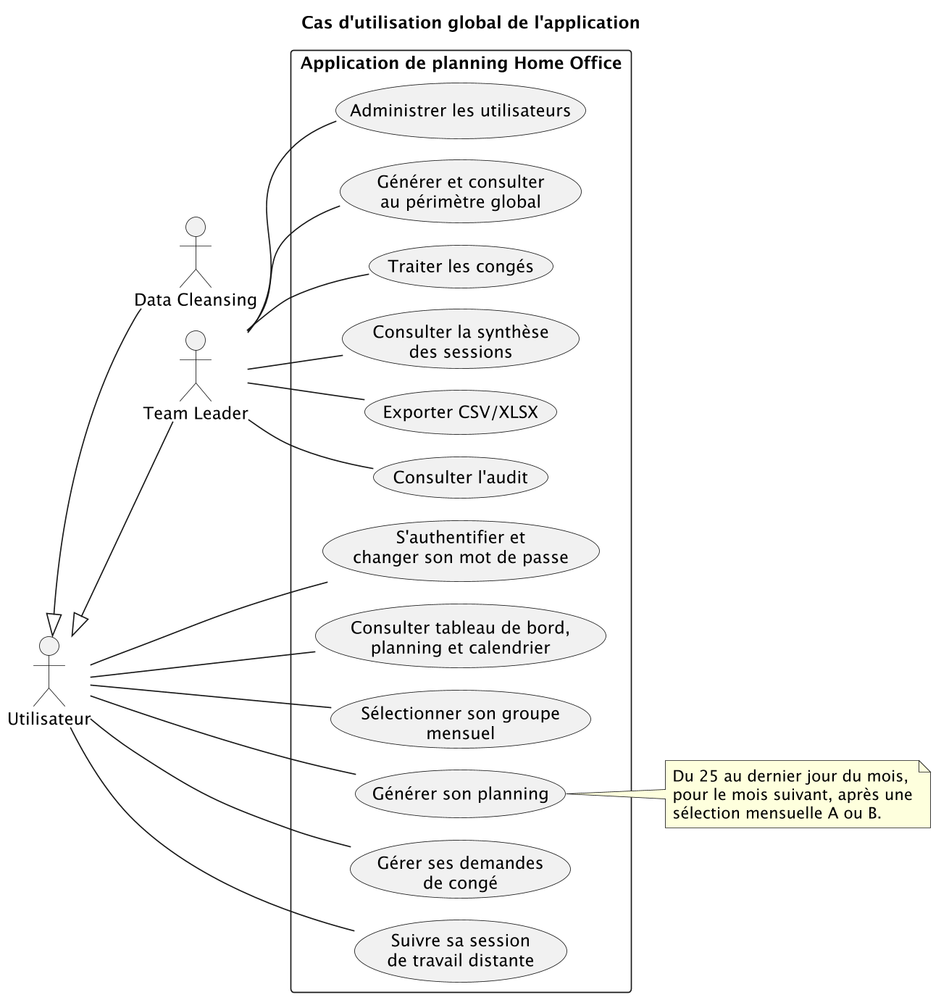

*Figure 1 - Cas d'utilisation global de l'application.*

La modélisation souligne la séparation entre l'usage individuel et la supervision. Elle ne fait intervenir aucun service de messagerie externe, puisque les notifications réalisées sont visuelles dans l'application.

*Source : diagramme PlantUML fourni, vérifié par rapport aux routes et permissions.*

<!-- PAGE_BREAK -->

<!-- PAGE 22 -->

## 2.6 Architecture générale

L'application est un monolithe Express. Le même processus sert les pages, expose les API JSON, applique les middlewares et accède à MySQL. Ce choix simplifie la cohérence du prototype et le déploiement futur d'une première version, tout en imposant une discipline claire dans la séparation des responsabilités.

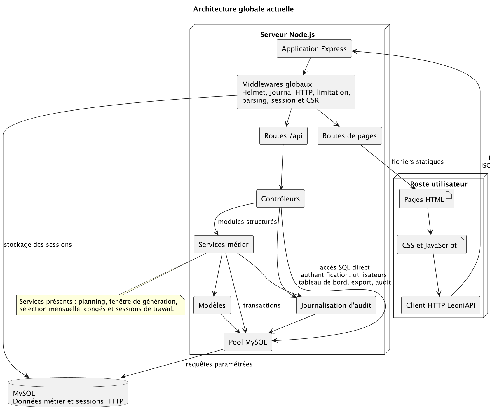

*Figure 2 - Architecture globale du prototype.*

Le navigateur charge des pages HTML, une feuille CSS et des scripts JavaScript. Les appels API traversent la session, la protection CSRF, les contrôles d'accès et les validations avant d'atteindre les contrôleurs, services ou modèles. Les données et les sessions HTTP sont conservées dans MySQL.

*Source : server.js, routes, middlewares, configuration de base et vues.*

<!-- PAGE_BREAK -->

<!-- PAGE 23 -->

## 2.7 Composants de l'application

L'organisation du code s'inspire d'une architecture en couches : les routes décrivent l'entrée HTTP, les contrôleurs adaptent requêtes et réponses, les services portent les règles complexes, les modèles centralisent une partie des accès SQL et les middlewares gèrent les préoccupations transversales.

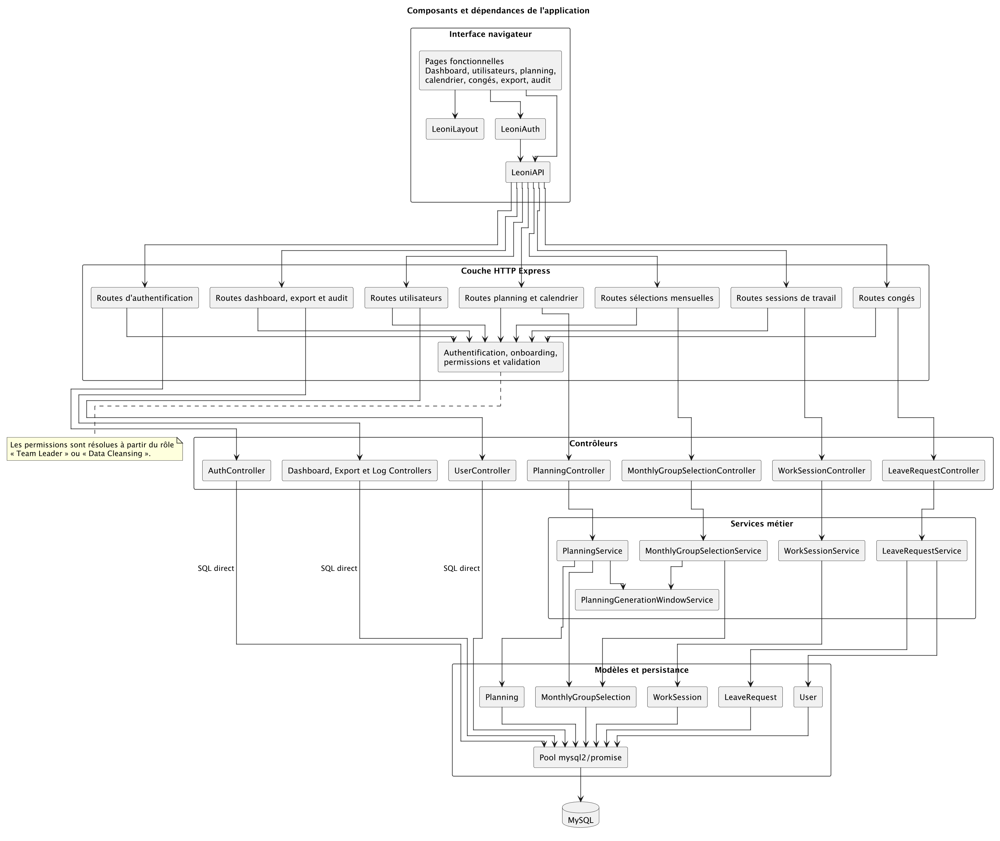

*Figure 3 - Composants backend, frontend et données.*

Cette séparation reste hétérogène. Certains contrôleurs effectuent encore directement des requêtes, alors que les flux de génération, de sélection, de congés et de sessions sont davantage structurés autour de services. Le rapport parle donc d'une architecture inspirée de couches plutôt que d'une application uniformément stratifiée.

*Source : arborescence et responsabilités des modules du code actuel.*

<!-- PAGE_BREAK -->

<!-- PAGE 24 -->

## 2.8 Modèle de données

Le modèle relationnel relie les utilisateurs aux sélections mensuelles, aux jours planifiés, aux sessions de travail, aux demandes de congé et aux événements d'audit. Les clés étrangères structurent la propriété ; les contraintes uniques empêchent plusieurs états incompatibles.

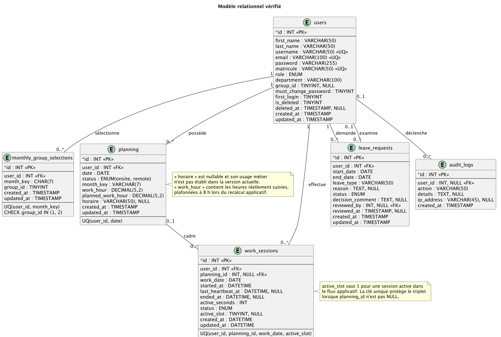

*Figure 4 - Modèle de données principal.*

Le modèle distingue volontairement la planification et la mesure : planned_work_hour représente la durée prévue d'une journée, tandis que work_hour reçoit la durée réellement cumulée à partir des sessions actives.

*Source : schéma SQL consolidé et migrations numérotées.*

<!-- PAGE_BREAK -->

<!-- PAGE 25 -->

## 2.9 Tables et mécanismes d'intégrité

Six tables métier dominent le modèle. Leur articulation permet de suivre l'état mensuel sans écraser l'historique et de rattacher chaque opération à un utilisateur ou à une date.

**Tableau 7 - Tables principales et fonctions**

| Table | Fonction | Intégrité ou cycle de vie |
| --- | --- | --- |
| users | Compte, rôle, groupe historique et onboarding. | E-mail, nom d'utilisateur et matricule uniques ; suppression logique. |
| monthly_group_selections | Choix A/B par utilisateur et mois. | Unicité utilisateur/mois ; verrou métier après planning. |
| planning | Jours sur site ou distants, heures prévues/réalisées. | Unicité utilisateur/date ; relation vers users. |
| work_sessions | Périodes actives et cumuls en secondes. | Statuts active, paused, ended, expired ; prévention de l'actif concurrent. |
| leave_requests | Demande, statut et décision. | Cycle pending vers approved, rejected ou cancelled. |
| audit_logs | Événements importants. | Ajout par les flux applicatifs et lecture récente. |

Les transactions encadrent les opérations où plusieurs vérifications et écritures doivent rester cohérentes. La sélection mensuelle contrôle la fenêtre, le mois, l'existence d'un planning puis insère ou met à jour le choix. La génération vérifie l'utilisateur, la sélection et l'absence de doublon avant l'insertion en lot. Les verrous de lecture sur les lignes sensibles réduisent le risque de deux traitements concurrents.

Les contraintes SQL complètent la logique applicative. Une unicité utilisateur/date protège le planning même si deux requêtes franchissaient simultanément un contrôle préalable. Les relations déterminent aussi le comportement lors d'une suppression logique ou d'une évolution de compte. Cette complémentarité illustre une défense d'intégrité à plusieurs niveaux.

> **Limite de validation :** Les sorties de tests fournies utilisent des substituts pour plusieurs scénarios. Une campagne d'intégration sur une base MySQL isolée reste nécessaire pour valider tous les verrouillages et annulations réelles.

*Sources : services, modèles, schéma et migrations.*

<!-- PAGE_BREAK -->

<!-- PAGE 26 -->

## 2.10 Contrôle d'accès

Les rôles sont traduits en permissions atomiques. Cette approche évite de disperser uniquement des comparaisons de libellés et permet aux routes de déclarer l'action attendue. Les contrôles de propriété restent indispensables pour les ressources personnelles.

**Tableau 8 - Permissions par rôle**

| Permission fonctionnelle | Team Leader | Data Cleansing |
| --- | --- | --- |
| Lire le tableau de bord | Oui | Oui |
| Lire les statistiques globales | Oui | Non |
| Lire, créer, modifier ou désactiver un utilisateur | Oui | Non |
| Lire son planning et son calendrier | Oui | Oui |
| Lire tous les plannings | Oui | Non |
| Générer son planning | Oui | Oui |
| Générer pour un autre utilisateur | Oui | Non |
| Lire/écrire sa sélection mensuelle | Oui | Oui |
| Lire toutes les sélections | Oui | Non |
| Gérer ses demandes de congé | Oui | Oui |
| Traiter les demandes d'autrui | Oui | Non |
| Lire une synthèse de sessions | Oui | Non |
| Exporter CSV/XLSX | Oui | Non |
| Lire l'audit | Oui | Non |

Le tableau décrit la matrice configurée, mais son application n'est pas uniforme. L'endpoint des statistiques ne vérifie pas dashboard.statistics et les lectures de planning s'appuient encore sur des comparaisons de rôle dans le service plutôt que sur planning.read.all. La permission settings.manage n'est associée à aucun module identifié. Ces écarts doivent être corrigés et testés avant de considérer la matrice comme entièrement appliquée.

*Sources : matrice de permissions, routes de pages et routes API.*

<!-- PAGE_BREAK -->

<!-- PAGE 27 -->

## 2.11 Conception de la sécurité

La sécurité observable s'organise en plusieurs couches. L'authentification vérifie le mot de passe avec bcrypt, puis conserve dans la session un profil réduit. Le stockage des sessions repose sur MySQL. Les pages métier exigent une session et, lorsque nécessaire, la fin du premier changement de mot de passe.

- Helmet configure des en-têtes HTTP et une politique de sécurité du contenu.
- La protection CSRF s'applique aux requêtes d'écriture après l'installation de la session.
- Un limiteur général et un limiteur spécifique réduisent la fréquence de certaines requêtes.
- express-validator contrôle formats, longueurs, dates et valeurs autorisées.
- Les permissions et contrôles de propriété limitent le périmètre des ressources.
- Les erreurs typées évitent de déduire la réponse HTTP d'un texte libre.
- L'échappement HTML partagé réduit le risque d'injection dans les écrans couverts par les tests.
- Les transactions, verrous et unicités protègent l'intégrité des écritures sensibles.

Le suivi du travail distant est conçu pour comptabiliser une activité applicative sans surveillance intrusive. Le navigateur envoie un heartbeat, demande une pause après inactivité, puis permet la reprise ou la fin. Le serveur expire les sessions trop anciennes et cumule les secondes actives. Aucune capture d'écran, frappe, coordonnée de souris ou liste d'applications visitées n'est enregistrée par ce mécanisme.

La séparation des heures prévues et réalisées évite de confondre une journée planifiée avec une durée effectivement comptabilisée. La durée réelle est plafonnée à huit heures par jour. Ce plafond et la logique de transition doivent néanmoins être vérifiés dans des scénarios d'intégration avec horloge, base et navigateur réels.

> **Portée de l'analyse :** Le présent rapport documente des contrôles présents dans le code. Il ne conclut pas à une certification de sécurité, à l'absence de vulnérabilité ni à la conformité d'un environnement de production.

*Sources : server.js, middlewares, validations, services de session et schéma SQL.*

<!-- PAGE_BREAK -->

<!-- PAGE 28 -->

## 2.12 Séquence d'authentification

L'utilisateur soumet son e-mail et son mot de passe. Le serveur valide le format, limite les tentatives, recherche le compte actif et compare le hash. La session est ensuite établie, avec une redirection vers le renouvellement initial ou le tableau de bord.

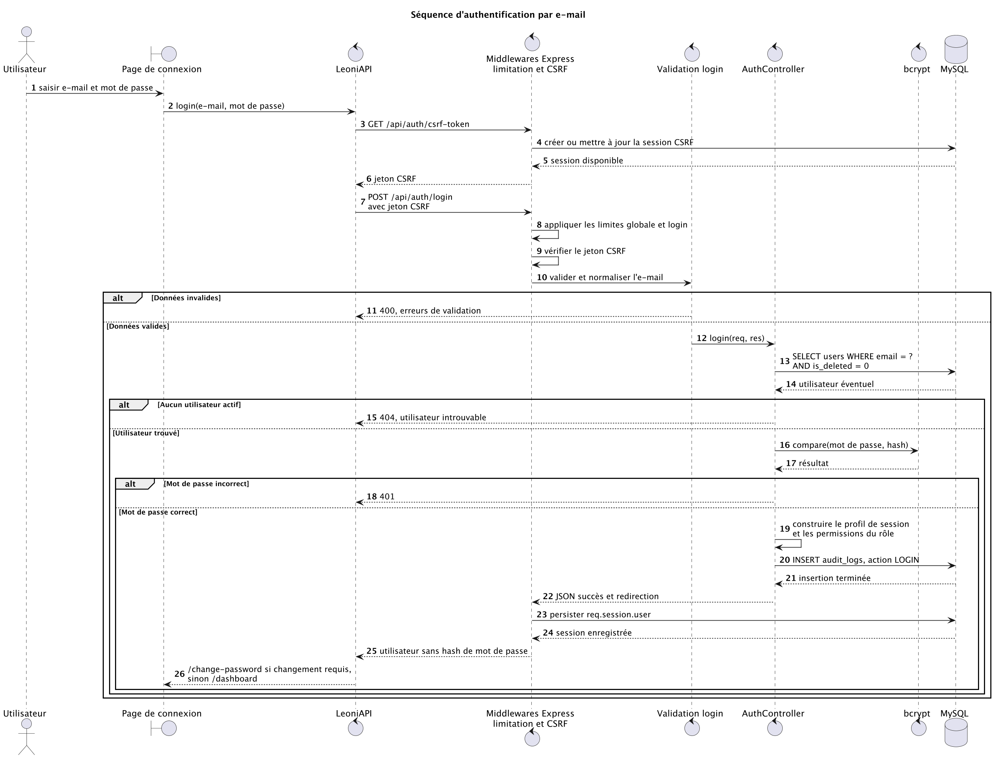

*Figure 5 - Séquence d'authentification.*

> **Lecture :** Le diagramme représente le flux confirmé par le code. Les erreurs, annulations et contrôles restent résumés pour conserver une lecture A4.

*Source : routes d'authentification, contrôleur, validation et script de connexion.*

<!-- PAGE_BREAK -->

<!-- PAGE 29 -->

## 2.13 Séquence de changement du mot de passe

Le changement personnel exige une session valide, l'ancien mot de passe et un nouveau mot de passe conforme. Après vérification, le hash est remplacé et les indicateurs de premier accès sont désactivés.

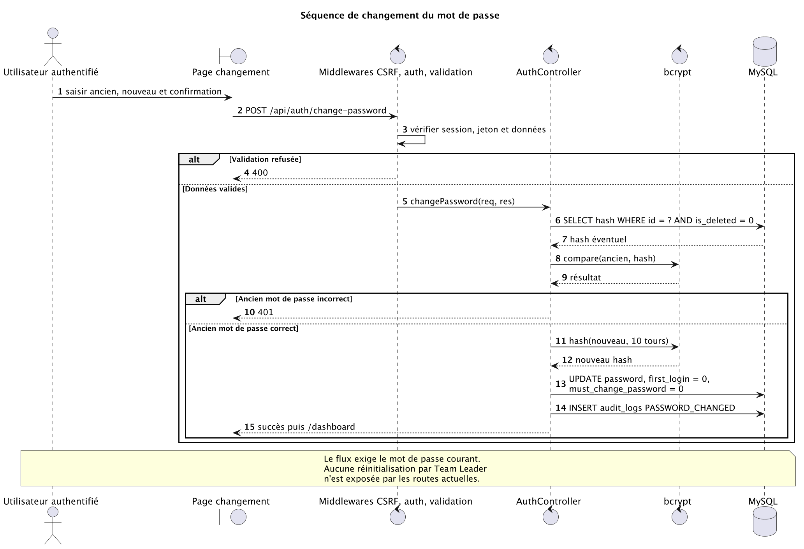

*Figure 6 - Séquence de changement du mot de passe.*

> **Lecture :** Le diagramme représente le flux confirmé par le code. Les erreurs, annulations et contrôles restent résumés pour conserver une lecture A4.

*Source : middleware d'onboarding, contrôleur d'authentification et validation.*

<!-- PAGE_BREAK -->

<!-- PAGE 30 -->

## 2.14 Séquence de gestion d'un utilisateur

Le Team Leader autorisé transmet des données validées. Le contrôleur et le modèle vérifient les unicités avant création ou modification. La suppression est logique afin de conserver les relations et la traçabilité.

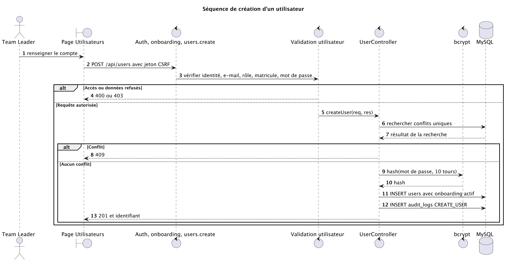

*Figure 7 - Séquence de gestion d'un utilisateur.*

> **Lecture :** Le diagramme représente le flux confirmé par le code. Les erreurs, annulations et contrôles restent résumés pour conserver une lecture A4.

*Source : routes, contrôleur et modèle utilisateur.*

<!-- PAGE_BREAK -->

<!-- PAGE 31 -->

## 2.15 Séquence de sélection mensuelle

La sélection A/B est personnelle. Le service calcule la fenêtre, refuse un mois différent de la cible, verrouille les données utiles et interdit la modification si le planning existe déjà.

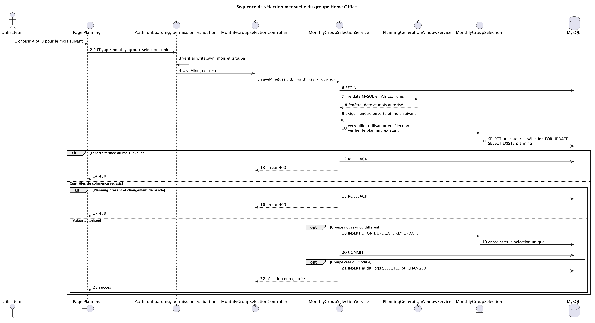

*Figure 8 - Séquence de sélection mensuelle du groupe.*

> **Lecture :** Le diagramme représente le flux confirmé par le code. Les erreurs, annulations et contrôles restent résumés pour conserver une lecture A4.

*Source : service et modèle de sélection mensuelle.*

<!-- PAGE_BREAK -->

<!-- PAGE 32 -->

## 2.16 Séquence de génération du planning

La génération réévalue côté serveur la date métier, le mois cible, l'utilisateur, la sélection et l'absence de planning. Les dates du groupe sont calculées puis insérées dans une transaction.

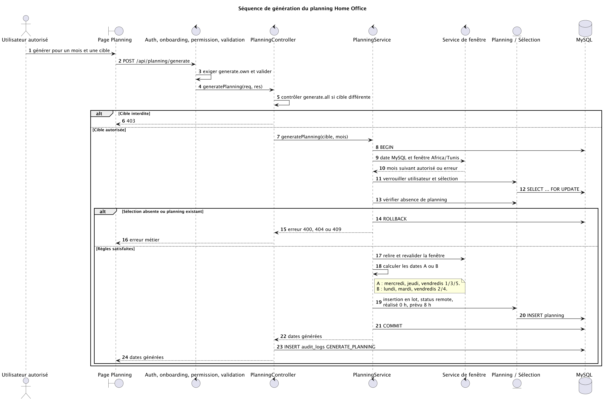

*Figure 9 - Séquence de génération du planning.*

> **Lecture :** Le diagramme représente le flux confirmé par le code. Les erreurs, annulations et contrôles restent résumés pour conserver une lecture A4.

*Source : contrôleur, service de planning et modèle de sélection.*

<!-- PAGE_BREAK -->

<!-- PAGE 33 -->

## 2.17 Séquence de consultation du planning

Les filtres sont validés et le périmètre est déterminé à partir de la session. Le profil Data Cleansing reste limité à ses lignes ; le Team Leader autorisé peut élargir la consultation.

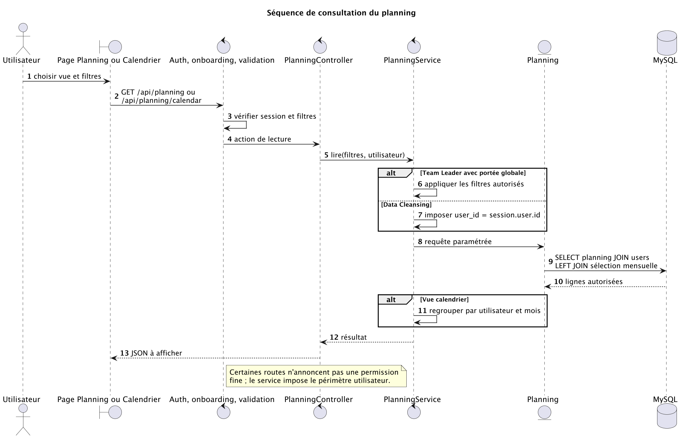

*Figure 10 - Séquence de consultation du planning.*

> **Lecture :** Le diagramme représente le flux confirmé par le code. Les erreurs, annulations et contrôles restent résumés pour conserver une lecture A4.

*Source : routes, service de planning et scripts des vues.*

<!-- PAGE_BREAK -->

<!-- PAGE 34 -->

## 2.18 Création d'une demande de congé

Le demandeur saisit une période, un type et un motif conformes. Le service contrôle les dates, recherche un chevauchement pending ou approved, crée la demande puis journalise l'action.

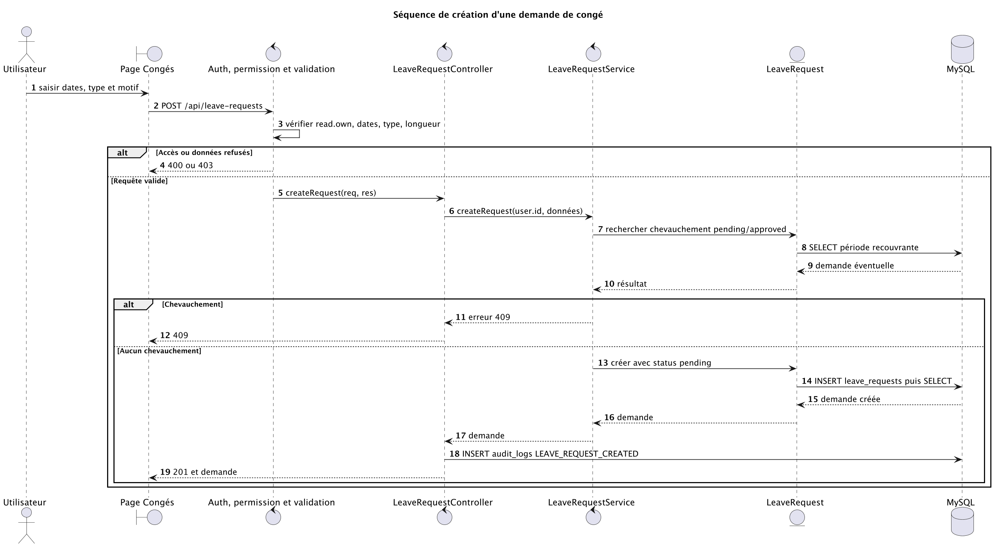

*Figure 11 - Séquence de création d'une demande de congé.*

> **Lecture :** Le diagramme représente le flux confirmé par le code. Les erreurs, annulations et contrôles restent résumés pour conserver une lecture A4.

*Source : routes, validations et service des congés.*

<!-- PAGE_BREAK -->

<!-- PAGE 35 -->

## 2.19 Traitement d'une demande de congé

Le Team Leader peut approuver ou rejeter une demande encore pending appartenant à une autre personne. Le statut, le réviseur et l'événement d'audit sont mis à jour dans le flux prévu.

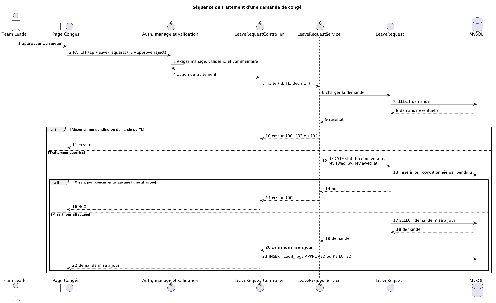

*Figure 12 - Séquence de traitement d'une demande de congé.*

> **Lecture :** Le diagramme représente le flux confirmé par le code. Les erreurs, annulations et contrôles restent résumés pour conserver une lecture A4.

*Source : service des congés et journal applicatif.*

<!-- PAGE_BREAK -->

<!-- PAGE 36 -->

## 2.20 Session de travail distant

Une session ne peut démarrer ou reprendre que pour un planning remote personnel à la date serveur. Heartbeat, pause, reprise, fin et expiration alimentent un cumul de secondes puis les heures réelles.

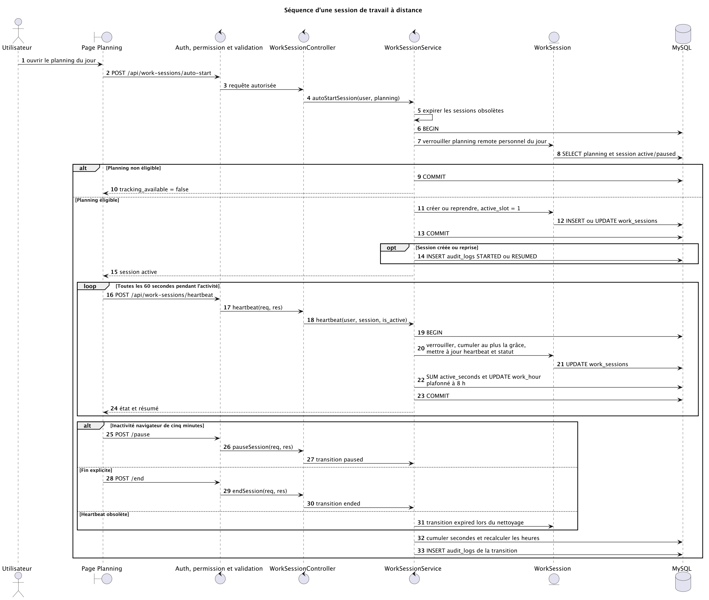

*Figure 13 - Séquence d'une session de travail distant.*

> **Lecture :** Le diagramme représente le flux confirmé par le code. Les erreurs, annulations et contrôles restent résumés pour conserver une lecture A4.

*Source : routes, service et modèle de sessions.*

<!-- PAGE_BREAK -->

<!-- PAGE 37 -->

## 2.21 Export CSV ou XLSX

Le Team Leader disposant de la permission choisit un format et des filtres. Le contrôleur lit les lignes autorisées, construit le fichier, prépare la réponse de téléchargement et crée un événement d'audit.

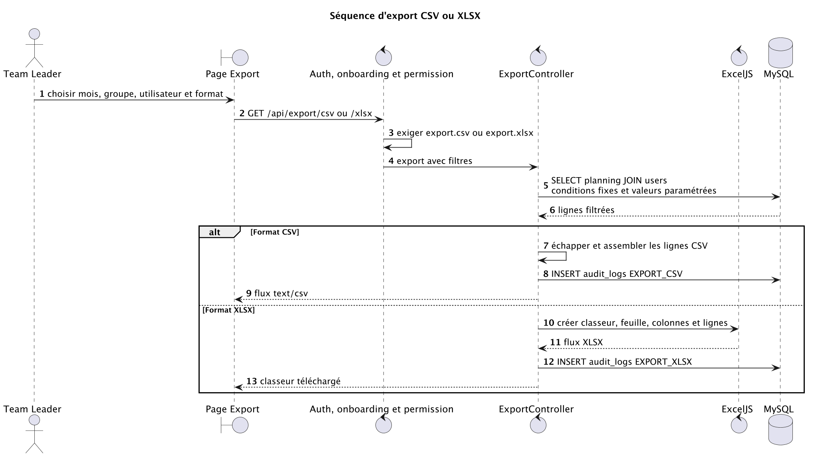

*Figure 14 - Séquence d'export CSV ou XLSX.*

> **Lecture :** Le diagramme représente le flux confirmé par le code. Les erreurs, annulations et contrôles restent résumés pour conserver une lecture A4.

*Source : routes et contrôleur d'export.*

<!-- PAGE_BREAK -->

<!-- PAGE 38 -->

## 2.22 Consultation de l'audit

La lecture du journal est réservée au profil autorisé. Le contrôleur retourne les événements récents, puis l'interface présente les actions, acteurs et détails après échappement.

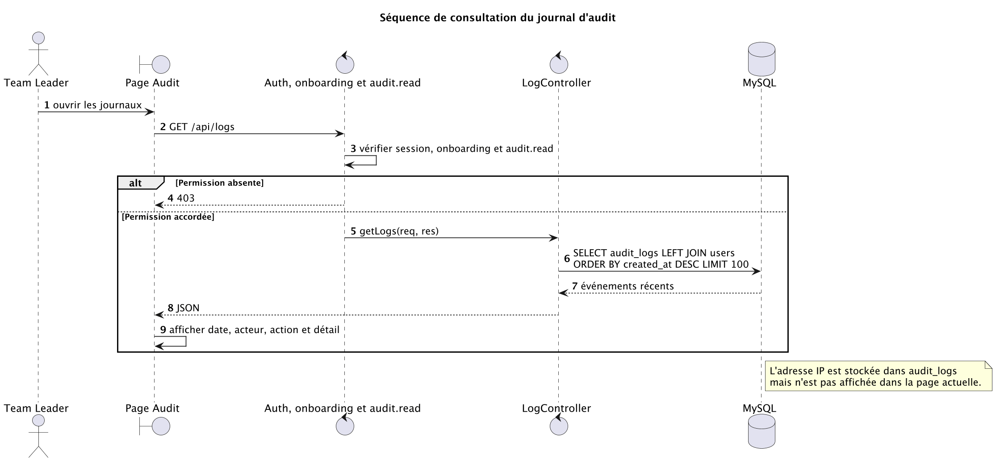

*Figure 15 - Séquence de consultation de l'audit.*

> **Lecture :** Le diagramme représente le flux confirmé par le code. Les erreurs, annulations et contrôles restent résumés pour conserver une lecture A4.

*Source : routes d'audit, contrôleur et script d'interface.*

<!-- PAGE_BREAK -->

<!-- PAGE 39 -->

## 2.23 Synthèse de la conception

La conception relie une règle temporelle, une sélection mensuelle et une génération déterministe. La date métier est obtenue côté serveur dans Africa/Tunis. Avant le 25, la fenêtre est fermée. Du 25 au dernier jour réel, le seul mois accepté est le mois immédiatement suivant, y compris lors du passage de décembre à janvier.

Pour le groupe A, le générateur retient les mercredis, les jeudis et les vendredis de rang impair dans le mois. Pour le groupe B, il retient les lundis, les mardis et les vendredis de rang pair. Chaque date générée est enregistrée comme journée remote, avec huit heures prévues et zéro heure réalisée au moment de la création. L'unicité utilisateur/date prévient un doublon.

1. Étape 1 : calculer la date métier et le mois cible.
2. Étape 2 : vérifier que la fenêtre est ouverte et que le mois demandé correspond.
3. Étape 3 : contrôler l'utilisateur cible et le périmètre du demandeur.
4. Étape 4 : charger la sélection mensuelle A ou B.
5. Étape 5 : refuser toute génération déjà existante pour le mois.
6. Étape 6 : calculer les jours, insérer le lot et journaliser l'opération.

Cette chaîne protège le système contre une date fournie uniquement par le navigateur, une sélection ancienne réutilisée par erreur ou une génération concurrente. Les transactions et verrous renforcent l'ensemble, tandis que les erreurs typées rendent les refus plus prévisibles pour le contrôleur et l'interface.

Le modèle conserve toutefois des axes d'amélioration : uniformiser les accès aux données, élargir les tests d'intégration, expliciter toutes les permissions de lecture et vérifier les comportements sur une base réelle. Ces points sont repris dans les perspectives sans remettre en cause la valeur du prototype.

> **Bilan du chapitre :** Les quinze diagrammes PlantUML ont été rendus depuis les sources fournies. Leur insertion vise à expliquer le code, non à revendiquer des systèmes ou acteurs externes absents.

*Sources : services de fenêtre, sélection et planning ; tests automatisés ; diagrammes PlantUML.*

<!-- PAGE_BREAK -->

<!-- PAGE 40 -->

# Chapitre 3 - Réalisation

## 3.1 Environnement et organisation technique

La réalisation repose sur une pile web classique, adaptée à un prototype interne : Node.js et Express pour le serveur, MySQL pour les données et les sessions, puis HTML, CSS et JavaScript natif côté navigateur. Bootstrap complète les composants d'interface. Le projet est structuré en répertoires fonctionnels afin de distinguer les entrées HTTP, la logique métier, les données et les ressources d'écran.

**Tableau 9 - Environnement technique**

| Élément | Rôle dans la solution | Observation |
| --- | --- | --- |
| Node.js / npm | Exécution serveur et gestion des dépendances. | CommonJS et tests natifs node:test. |
| Express | Pages, API JSON et chaîne de middlewares. | Application monolithique. |
| MySQL / mysql2 | Données métier, transactions et magasin de sessions. | Pool de connexions et SQL paramétré. |
| HTML5 / CSS3 | Structure et présentation des pages. | Feuille de style partagée et responsive. |
| JavaScript navigateur | Appels API, formulaires, calendrier et suivi. | Modules partagés pour API, session et mise en page. |
| Bootstrap | Composants visuels et adaptation d'écran. | Utilisé avec le style spécifique du projet. |
| ExcelJS | Construction du classeur XLSX. | Export réservé par permission. |
| PlantUML | Modélisation des cas, composants, données et séquences. | Quinze diagrammes fournis et rendus. |

Les répertoires routes, controllers, services, models, middlewares, validations et views donnent une lecture en couches. La séparation n'est pas uniforme : l'authentification, les utilisateurs, le tableau de bord, l'export et l'audit utilisent encore directement le pool SQL depuis leur contrôleur, alors que le planning, la sélection, les congés et les sessions s'appuient davantage sur des services et modèles.

Le serveur sert les pages et les ressources statiques, installe la session, les protections HTTP et les routeurs, puis déclenche un nettoyage périodique des sessions de travail obsolètes. La présence de cette organisation facilite la documentation, mais ne doit pas être assimilée à une architecture distribuée : tous les modules appartiennent au même processus Express.

> **Portée :** Les versions, commandes et mécanismes décrits proviennent des fichiers du projet et des sorties fournies. Aucun environnement de production n'est déduit de cette pile.

*Sources : package.json, server.js et arborescence du projet.*

<!-- PAGE_BREAK -->

<!-- PAGE 41 -->

## 3.2 Authentification par e-mail

La page de connexion collecte une adresse e-mail et un mot de passe. Le navigateur envoie les données à l'API, tandis que le serveur valide le format, applique la limitation spécifique, recherche un compte actif et compare le hash bcrypt. La réponse de session contient un profil réduit et les permissions dérivées du rôle.

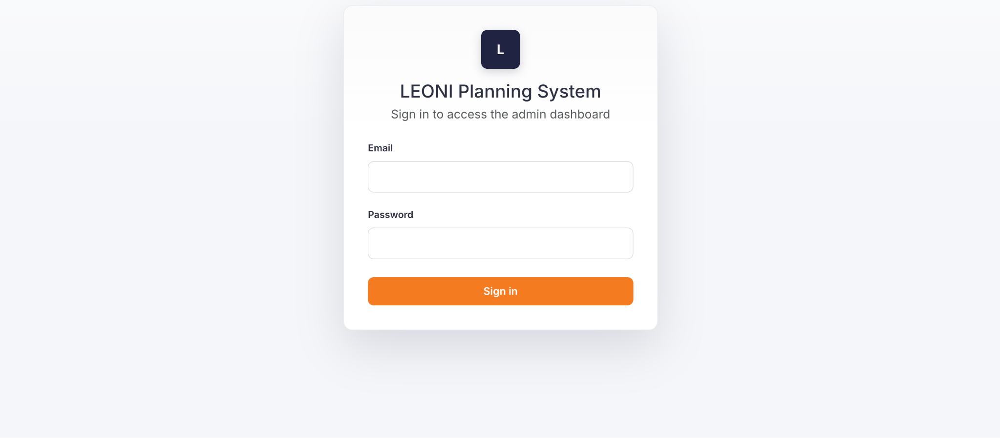

*Figure 16 - Page de connexion avec champs vides.*

> **Interprétation :** La capture confirme le rendu de l'écran. Elle ne prouve pas à elle seule le cycle complet cookie, base et redirection.

*Source : capture fournie, recadrée et anonymisée par masques opaques.*

<!-- PAGE_BREAK -->

<!-- PAGE 42 -->

## 3.3 Premier changement de mot de passe

Lorsque first_login ou must_change_password est actif, le middleware limite l'accès métier et redirige vers la page dédiée. L'utilisateur saisit son ancien mot de passe, un nouveau mot de passe conforme et sa confirmation. Après vérification, le hash est remplacé et les indicateurs d'onboarding sont désactivés.

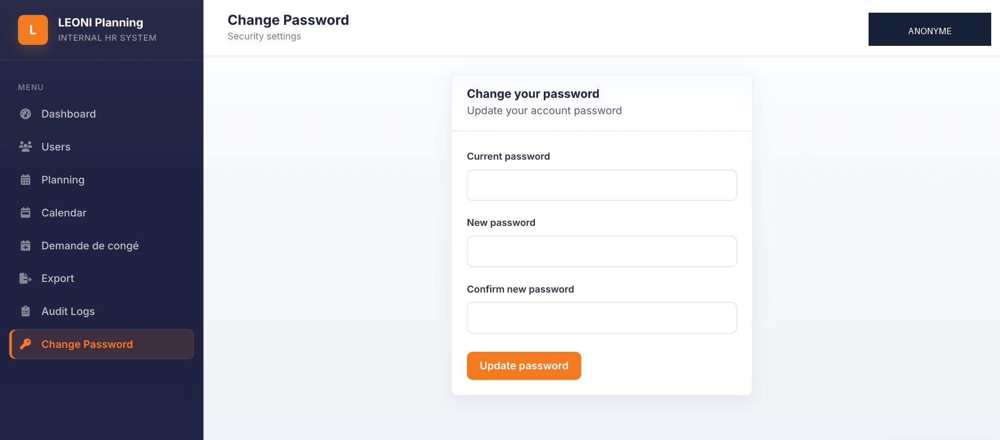

*Figure 17 - Écran de changement obligatoire du mot de passe.*

> **Interprétation :** Une seule des deux captures presque identiques a été retenue. Aucun secret ni valeur saisie n'est visible.

*Source : capture fournie, recadrée et anonymisée par masques opaques.*

<!-- PAGE_BREAK -->

<!-- PAGE 43 -->

## 3.4 Tableau de bord

Le tableau de bord rassemble des cartes statistiques, l'état de la fenêtre de génération, le mois cible et des synthèses. Les valeurs visibles dans la capture sont des données de démonstration. Le mois cible doit provenir de la fenêtre calculée par le serveur, ce comportement faisant partie des scénarios automatisés.

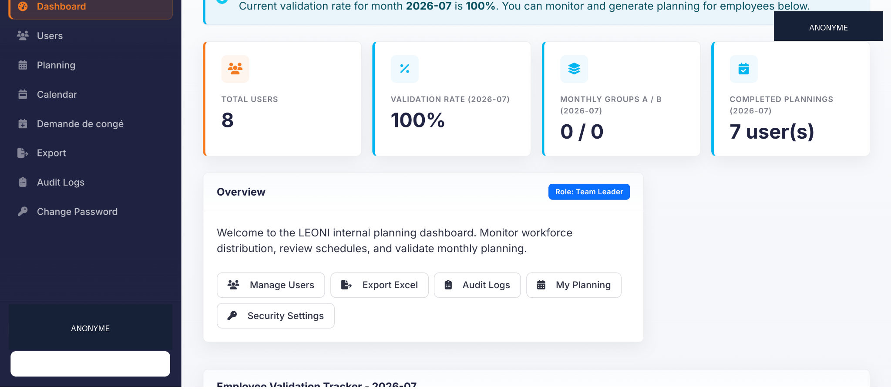

*Figure 18 - Tableau de bord du Team Leader.*

> **Interprétation :** La permission dashboard.statistics existe dans la configuration mais n'est pas appliquée à l'endpoint de statistiques ; ce point impose une correction avant un usage plus large.

*Source : capture fournie, recadrée et anonymisée par masques opaques.*

<!-- PAGE_BREAK -->

<!-- PAGE 44 -->

## 3.5 Gestion des utilisateurs

Le Team Leader peut lister, créer, modifier et désactiver logiquement un utilisateur selon des permissions distinctes. Les contrôles portent notamment sur l'e-mail, le matricule, le rôle et les unicités. La suppression logique conserve la ligne et ses relations au lieu de l'effacer physiquement.

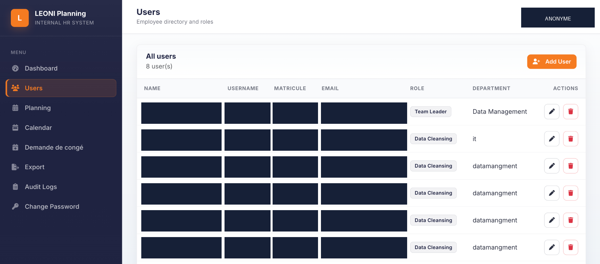

*Figure 19 - Page de gestion des utilisateurs anonymisée.*

> **Interprétation :** Les noms, e-mails et matricules ont été recouverts par des masques opaques. Aucun écran de réinitialisation du mot de passe par le Team Leader n'est exposé.

*Source : capture fournie, recadrée et anonymisée par masques opaques.*

<!-- PAGE_BREAK -->

<!-- PAGE 45 -->

## 3.6 Génération et suivi du planning

La page Planning affiche la fenêtre, le mois cible, la sélection de groupe et les lignes accessibles. Lorsque la fenêtre est fermée, aucune génération ne doit être acceptée par le serveur. Lorsqu'elle est ouverte, la cible reste le mois suivant, indépendamment d'un paramètre proposé par le navigateur.

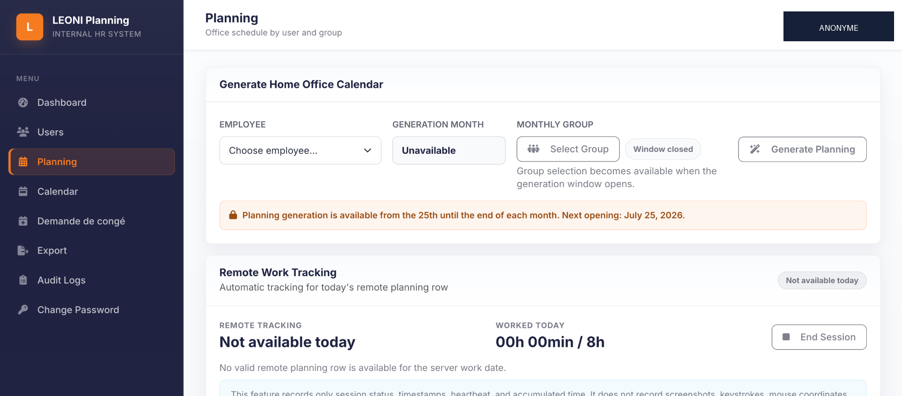

*Figure 20 - Planning du Team Leader lorsque la fenêtre est fermée.*

> **Interprétation :** Le générateur crée uniquement les jours distants ; il ne produit pas des lignes onsite. Le calendrier met donc en évidence les jours remote enregistrés.

*Source : capture fournie, recadrée et anonymisée par masques opaques.*

<!-- PAGE_BREAK -->

<!-- PAGE 46 -->

## 3.7 Suivi non intrusif du travail distant

Le suivi démarre ou reprend une session uniquement si l'utilisateur possède un planning remote pour la date MySQL courante. Le navigateur transmet un heartbeat toutes les 60 secondes, détecte une inactivité après cinq minutes et demande une pause lors de la perte de visibilité. Le serveur expire les sessions obsolètes, cumule les secondes et met à jour l'heure réalisée.

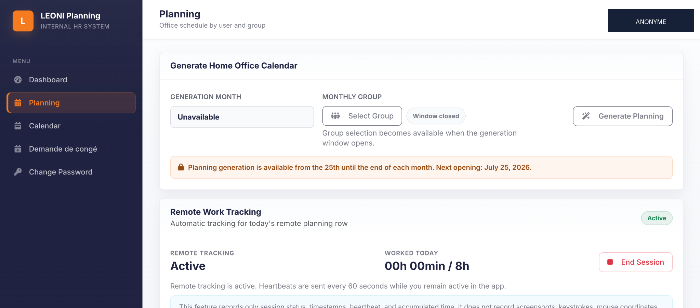

*Figure 21 - Suivi distant actif côté Data Cleansing.*

> **Interprétation :** Le mécanisme mesure l'activité de la page Planning, pas le travail global sur le poste. Il ne transmet ni capture d'écran, ni frappe, ni coordonnée de souris, ni application visitée.

*Source : capture fournie, recadrée et anonymisée par masques opaques.*

<!-- PAGE_BREAK -->

<!-- PAGE 47 -->

## 3.8 Calendrier du Team Leader

La vue calendaire transforme les lignes de planning autorisées en repères mensuels. Pour le Team Leader, le périmètre peut couvrir plusieurs utilisateurs selon les contrôles du service. Les filtres et la navigation mensuelle servent à retrouver les jours distants enregistrés.

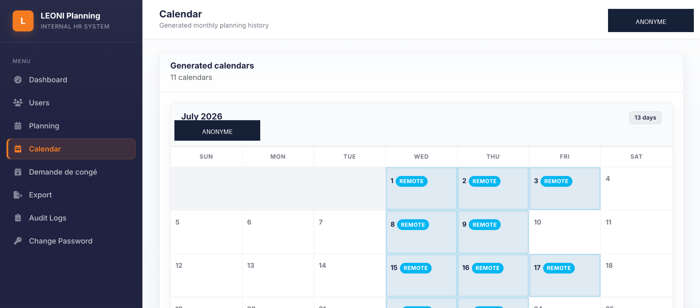

*Figure 22 - Calendrier du Team Leader anonymisé.*

> **Interprétation :** La capture prouve le rendu de la grille et non l'exhaustivité d'un planning présence/distance.

*Source : capture fournie, recadrée et anonymisée par masques opaques.*

<!-- PAGE_BREAK -->

<!-- PAGE 48 -->

## 3.8 Calendrier personnel Data Cleansing

Le profil Data Cleansing consulte son propre calendrier. Le service limite le périmètre à l'identifiant de la session, même si un paramètre différent est soumis. Cette règle de propriété évite qu'un simple changement de filtre suffise à consulter les lignes d'un tiers.

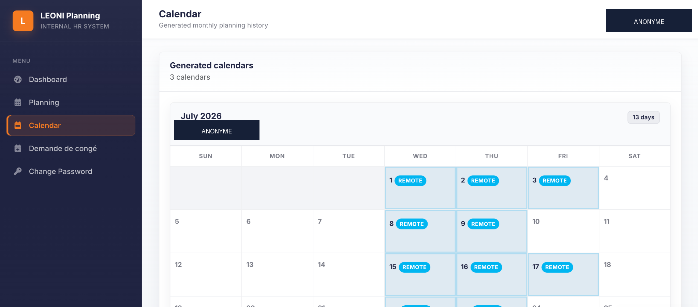

*Figure 23 - Calendrier personnel Data Cleansing anonymisé.*

> **Interprétation :** Le test automatisé de portée croisée confirme un refus typé pour l'accès au planning d'un autre utilisateur dans le service couvert.

*Source : capture fournie, recadrée et anonymisée par masques opaques.*

<!-- PAGE_BREAK -->

<!-- PAGE 49 -->

## 3.9 Traitement des congés

Le Team Leader peut lire les demandes et approuver ou rejeter une demande pending appartenant à une autre personne. La décision utilise une mise à jour conditionnée par le statut, ce qui empêche deux décisions concurrentes de réussir sur la même ligne. La création, en revanche, ne place pas la recherche de chevauchement et l'insertion dans une transaction unique.

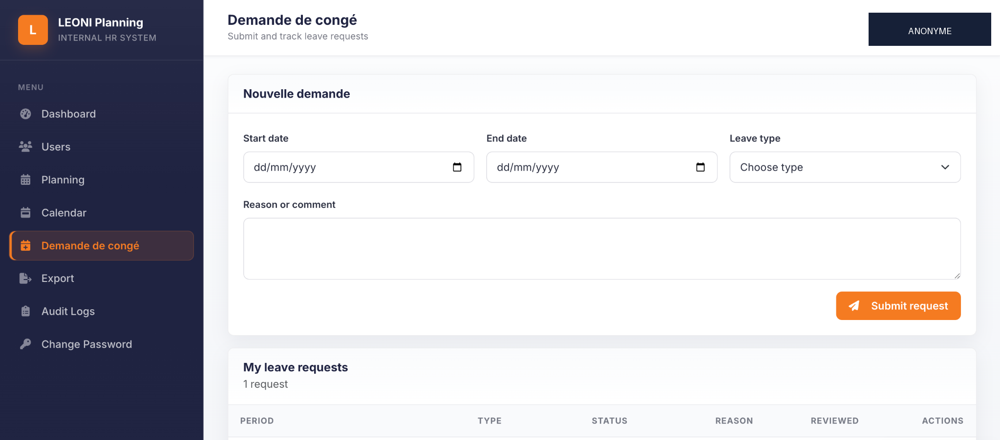

*Figure 24 - Gestion des congés côté Team Leader, données sensibles masquées.*

> **Interprétation :** Une approbation de congé n'entraîne pas automatiquement une modification du planning ; les deux modules restent indépendants.

*Source : capture fournie, recadrée et anonymisée par masques opaques.*

<!-- PAGE_BREAK -->

<!-- PAGE 50 -->

## 3.9 Gestion personnelle des congés

Un utilisateur peut créer une demande validée, consulter son historique et annuler sa propre demande encore pending. Les dates, le type et le motif sont contrôlés. Le service refuse le traitement de sa propre demande par un Team Leader.

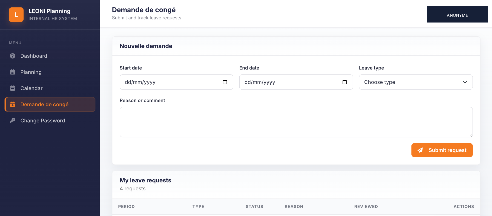

*Figure 25 - Gestion personnelle des congés, informations anonymisées.*

> **Interprétation :** Les dates, motifs, identités et informations de révision visibles dans la source ont été masqués. La capture ne remplace pas un test du cycle complet.

*Source : capture fournie, recadrée et anonymisée par masques opaques.*

<!-- PAGE_BREAK -->

<!-- PAGE 51 -->

## 3.10 Export CSV et XLSX

Deux formats sont disponibles : un CSV UTF-8 et un classeur XLSX produit avec ExcelJS. Les filtres portent sur le mois, le groupe mensuel et l'utilisateur. Les colonnes exportées couvrent l'identité fonctionnelle, la date distante et l'heure réalisée ; l'heure prévue n'est pas incluse.

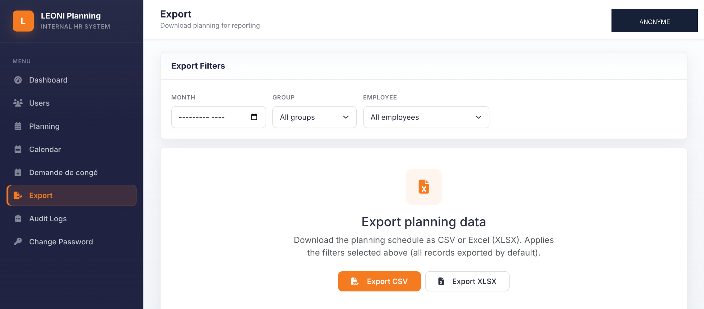

*Figure 26 - Page d'export CSV et XLSX.*

> **Interprétation :** Les lignes sont chargées en mémoire sans pagination. Le CSV échappe les séparateurs et guillemets mais ne neutralise pas explicitement les marqueurs de formule, point à renforcer.

*Source : capture fournie, recadrée et anonymisée par masques opaques.*

<!-- PAGE_BREAK -->

<!-- PAGE 52 -->

## 3.11 Journal d'audit

Le journal conserve des actions telles que connexion, changement de mot de passe, gestion de comptes, sélection, génération, congés, exports et transitions de sessions. La page est réservée par permission et affiche jusqu'aux cent événements récents.

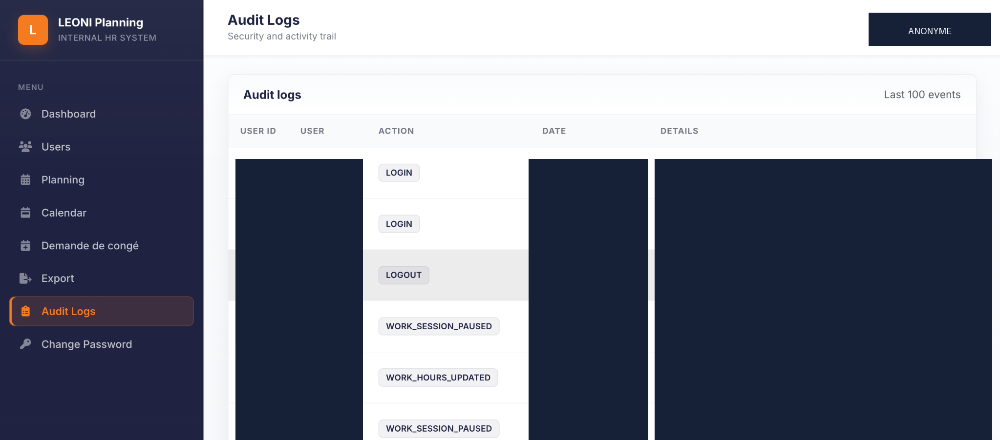

*Figure 27 - Journal d'audit anonymisé.*

> **Interprétation :** La journalisation est best effort : une erreur d'audit peut être absorbée et l'opération métier rester réussie. Les refus et lectures ne sont pas tous journalisés.

*Source : capture fournie, recadrée et anonymisée par masques opaques.*

<!-- PAGE_BREAK -->

<!-- PAGE 53 -->

## 3.12 Gestion des erreurs 404 et 403

Le projet prévoit des pages distinctes pour les ressources introuvables et les accès interdits. La capture fournie affiche le contenu d'une page 404, même si la barre d'adresse visible dans l'image source contenait /403. Elle doit donc être interprétée et légendée comme une page 404.

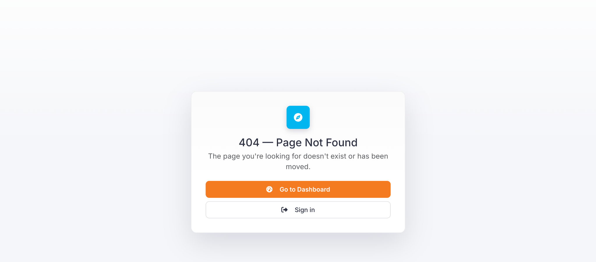

*Figure 28 - Page 404 fournie, recadrée.*

> **Interprétation :** Aucune capture réelle de page 403 n'a été fournie. Le comportement 403 est décrit uniquement à partir des middlewares, permissions et erreurs typées du code.

*Source : capture fournie, recadrée et anonymisée par masques opaques.*

<!-- PAGE_BREAK -->

<!-- PAGE 54 -->

## 3.13 Bilan de réalisation

La version finale assemble les fonctions attendues autour d'un même système. Le Team Leader dispose des écrans d'administration, de consultation globale, de traitement, d'export et d'audit. Le Data Cleansing gère ses propres choix, plannings, calendriers, congés et sessions. Les contrôles importants sont placés côté serveur, même lorsque l'interface adapte aussi le menu et les actions visibles.

La réalisation technique présente plusieurs points solides : date métier centralisée pour la génération, validations explicites, erreurs typées, requêtes paramétrées, transactions sur la sélection et la génération, contraintes d'unicité et suivi distant sans collecte détaillée du poste. Les scripts partagés d'échappement et de session réduisent également les duplications côté navigateur.

L'audit du code met cependant en évidence des limites précises. Certaines permissions déclarées ne sont pas appliquées aux endpoints correspondants. Une modification de rôle ou une suppression logique ne révoque pas automatiquement une session déjà active. Les congés ne sont pas liés au planning et leur création n'est pas transactionnelle. La synthèse des sessions existe comme API mais n'est pas exposée par une page. Le filtre de groupe de cette synthèse s'appuie encore sur le groupe historique de l'utilisateur.

D'autres améliorations relèvent de la robustesse : régénérer la session après l'authentification, uniformiser les accès aux données, neutraliser l'injection de formules dans le CSV, rendre les migrations explicites, auditer les échecs importants, paginer les listes et valider la configuration des proxys et ressources externes avant tout déploiement.

- Fonction réalisée : alertes visuelles du tableau de bord ; aucun envoi externe revendiqué.
- Fonction réalisée : jours Home Office distants ; aucune génération complète des jours onsite.
- Fonction réalisée : heures prévues et réalisées séparées en base ; présentation non uniforme dans toutes les vues.
- Fonction non confirmée : déploiement de production, exploitation réelle ou supervision d'infrastructure.

> **Conclusion du chapitre :** Le prototype matérialise une piste technique centralisée en remplacement du traitement manuel. Les limites recensées orientent une phase de consolidation, sans être masquées par la qualité visuelle des écrans.

*Sources : code actuel, audit technique, diagrammes et captures fournies.*

<!-- PAGE_BREAK -->

<!-- PAGE 55 -->

# Chapitre 4 - Tests et validation

## 4.1 Protocole et résultats

La validation documentée s'appuie sur deux sorties réelles enregistrées le 17 juillet 2026. La suite automatisée a été lancée avec la commande node --test tests/*.test.js sous Node.js v22.16.0 et npm 10.9.2. Une vérification syntaxique séparée a été exécutée par npm run check:syntax. Le présent travail n'attribue aucun succès à un scénario qui ne figure pas dans ces preuves.

**Tableau 10 - Protocole et résultats automatisés**

| Élément | Valeur prouvée |
| --- | --- |
| Date d'exécution | 17 juillet 2026 |
| Commande des tests | node --test tests/*.test.js |
| Environnement | Node.js v22.16.0 ; npm 10.9.2 |
| Fichiers de tests | 5 |
| Tests détectés | 33 |
| Tests réussis | 33 |
| Échecs / annulés / ignorés / TODO | 0 / 0 / 0 / 0 |
| Durée enregistrée | 272,468626 ms |
| Commande syntaxique | npm run check:syntax |
| Résultat syntaxique | 58 fichiers valides sur 58 contrôlés |

Le résultat global est donc 33/33 pour les tests automatisés et 58/58 pour le périmètre du script syntaxique. La sortie TAP fournit un statut ok pour chaque sous-test puis confirme zéro échec. Les preuves sont archivées dans les deux fichiers texte du dossier tests_reels.

> **Règle d'interprétation :** La réussite de la suite établit uniquement les comportements couverts. Elle ne transforme pas le prototype en produit validé pour la production et ne remplace pas les tests HTTP, MySQL et navigateur manquants.

*Sources : sorties test_run_2026-07-17.txt et syntax_check_2026-07-17.txt.*

<!-- PAGE_BREAK -->

<!-- PAGE 56 -->

## 4.2 Répartition des cinq fichiers de tests

Les 33 sous-tests sont répartis dans cinq fichiers. Cette répartition combine la date métier, les gardes de sélection et de génération, le mois cible du tableau de bord et plusieurs propriétés du frontend.

**Tableau 11 - Répartition des cinq fichiers de tests**

| Fichier | Nombre | Domaine principal |
| --- | --- | --- |
| dashboardTargetMonth.test.js | 2 | Mois du tableau de bord : valeur serveur et mois explicitement demandé. |
| frontendPhase2.test.js | 7 | Échappement HTML, contenu de layout, session unique et absence de calcul local du mois cible. |
| monthlyGroupSelectionWindowGuard.test.js | 3 | Fenêtre fermée, mois différent et sauvegarde autorisée. |
| planningGenerationWindow.test.js | 11 | Jours 1-24, fins de mois, février, changement d'année et Africa/Tunis. |
| planningServiceGenerationGuard.test.js | 10 | Erreurs typées, propriété, mois, doublon et groupes A/B. |
| Total | 33 | Tous réussis dans la sortie fournie. |

Les tests de fenêtre couvrent les mois de 28, 29, 30 et 31 jours. Le passage de décembre à janvier et les limites de la période du 25 sont vérifiés. Le service de génération est exercé avec des doubles de données pour observer les refus avant insertion et la création de lignes pour les deux groupes.

Le fichier frontendPhase2 vérifie un échappement commun pour le texte et les attributs, l'usage de cet échappement dans le layout et le tableau de bord, ainsi que l'absence de requêtes de session répétées pendant l'initialisation des pages protégées. Ces tests sont ciblés sur les sources et ne constituent pas une campagne de navigateur réel.

> **Précision sur 58/58 :** Le script syntaxique contrôle 58 fichiers sélectionnés. D'après son code, il exclut notamment le point d'entrée serveur, le script de vérification lui-même et les cinq fichiers de tests ; 58/58 ne signifie donc pas l'intégralité de tous les fichiers JavaScript du dépôt.

*Sources : cinq fichiers de tests, script check-syntax et sorties enregistrées.*

<!-- PAGE_BREAK -->

<!-- PAGE 57 -->

## 4.3 Scénarios effectivement couverts

La matrice ci-dessous ne contient que des scénarios dont le résultat est identifiable dans la sortie TAP. Elle regroupe des sous-tests proches afin de conserver une lecture académique.

**Tableau 12 - Scénarios effectivement couverts**

| Domaine | Scénario couvert | Résultat |
| --- | --- | --- |
| Fenêtre | Fermeture du jour 1 au jour 24. | Réussi |
| Fenêtre | Ouverture du 25 au dernier jour réel. | Réussi |
| Calendrier | Février non bissextile et bissextile. | Réussi |
| Calendrier | Mois de 30/31 jours et passage décembre-janvier. | Réussi |
| Fuseau | Date métier et mois cible Africa/Tunis. | Réussi |
| Sélection | Refus hors fenêtre ou pour un autre mois. | Réussi |
| Sélection | Sauvegarde pour le prochain mois autorisé. | Réussi |
| Génération | Refus avant toute insertion lorsque la fenêtre est fermée. | Réussi |
| Génération | Erreurs typées pour format, utilisateur absent et accès croisé. | Réussi |
| Génération | Refus d'une sélection ancienne et d'un planning existant. | Réussi |
| Groupes | Création A et B limitée au mois autorisé. | Réussi |
| Dashboard | Mois par défaut serveur et mois demandé préservé. | Réussi |
| Frontend | Échappement HTML partagé. | Réussi |
| Frontend | Une seule requête de session et pas de calcul local du mois cible. | Réussi |

Les résultats renforcent la confiance dans la règle la plus sensible : le serveur décide du mois et de la fenêtre. Ils montrent également que le client s'appuie sur le contexte renvoyé au lieu de recalculer localement la cible. En revanche, la suite ne compare pas exhaustivement toutes les dates générées pour tous les mois et tous les rangs de vendredi.

*Source : sortie TAP du 17 juillet 2026 et code des cinq fichiers.*

<!-- PAGE_BREAK -->

<!-- PAGE 58 -->

## 4.4 Portée et limites des preuves

Les tests automatisés utilisent des doubles et des objets simulés pour plusieurs services. Ils confirment la logique testée sans reproduire tous les comportements d'une base, d'un cookie, d'un navigateur et d'un serveur complets.

**Tableau 13 - Limites des preuves automatisées**

| Domaine non démontré de bout en bout | Conséquence pour le rapport |
| --- | --- |
| Authentification, cookie, session et CSRF avec base réelle | Ne pas conclure à un cycle complet validé. |
| Administration des utilisateurs | Création, modification et suppression visibles dans le code, mais sans preuve automatisée fournie. |
| Congés | Aucun test du chevauchement, de l'annulation ou de la décision. |
| Sessions de travail | Transitions, expiration et plafond non couverts par la suite fournie. |
| Exports | Téléchargement et contenu CSV/XLSX non contrôlés automatiquement. |
| Migrations et contraintes MySQL | Verrous, annulations et schéma non éprouvés sur une instance isolée. |
| Sécurité dynamique | Aucune campagne de pénétration ou de validation complète des en-têtes. |
| Compatibilité | Aucune preuve multi-navigateur ou mobile. |
| Exploitation | Aucun déploiement, sauvegarde, supervision ou charge. |

Les treize captures uniques constituent des preuves visuelles de rendu. Elles confirment l'existence d'écrans, de cartes, de tableaux, de formulaires et d'états. Elles ne prouvent pas qu'une opération a réussi en base ni qu'une autorisation a été refusée. La capture finale prouve une page 404 ; aucune capture 403 réelle n'est disponible.

La validation honnête sépare donc quatre catégories : code inspecté, test automatisé réussi, rendu visuel fourni et scénario manuel non exécuté. Cette qualification est conservée dans la matrice des deux pages suivantes.

> **Principe de traçabilité :** Aucun test manuel n'est déclaré réussi sans compte rendu, sortie ou preuve dédiée.

*Sources : preuves de tests, catalogue des captures et audit du code.*

<!-- PAGE_BREAK -->

<!-- PAGE 59 -->

## 4.5 Matrice manuelle à exécuter - partie 1

Les scénarios suivants sont proposés pour une future recette. Leur statut reste Non exécuté, même lorsqu'une capture illustre l'écran concerné.

**Tableau 14 - Matrice manuelle à exécuter - partie 1**

| ID | Scénario | Statut | Preuve attendue |
| --- | --- | --- | --- |
| TM-01 | Connexion valide puis redirection selon l'onboarding. | Non exécuté | Cookie et compte d'essai contrôlé. |
| TM-02 | Refus d'un mot de passe incorrect sans fuite d'information. | Non exécuté | Réponse HTTP et journal technique. |
| TM-03 | Renouvellement initial puis accès au tableau de bord. | Non exécuté | État en base et nouvelle session. |
| TM-04 | Création d'un utilisateur avec unicités valides. | Non exécuté | Ligne créée et audit. |
| TM-05 | Refus d'un e-mail ou matricule déjà utilisé. | Non exécuté | Erreur et absence d'insertion. |
| TM-06 | Suppression logique et révocation des accès. | Non exécuté | État du compte et session active. |
| TM-07 | Data Cleansing refusé sur l'administration. | Non exécuté | Statut 403 réel. |
| TM-08 | Sélection A/B pendant la fenêtre. | Non exécuté | Choix persisté et audit. |
| TM-09 | Sélection refusée hors fenêtre. | Non exécuté | Réponse serveur réelle. |
| TM-10 | Génération complète d'un mois A puis B. | Non exécuté | Dates exactes en base. |

La priorité porte sur les parcours d'identité et la génération, car ils conditionnent tous les autres modules. Les essais doivent être réalisés dans une base isolée avec des comptes d'essai non sensibles. Les valeurs de configuration et les identifiants ne doivent pas être intégrés au compte rendu.

> **Méthode future :** Une capture d'interface peut compléter un scénario, mais la preuve attendue doit aussi inclure le statut HTTP, l'état persistant ou le fichier produit selon le cas.

*Source : limites identifiées dans les preuves automatisées.*

<!-- PAGE_BREAK -->

<!-- PAGE 60 -->

## 4.5 Matrice manuelle à exécuter - partie 2

**Tableau 15 - Matrice manuelle à exécuter - partie 2**

| ID | Scénario | Statut | Preuve attendue |
| --- | --- | --- | --- |
| TM-11 | Consultation croisée planning et calendrier selon le rôle. | Non exécuté | Réponses 200/403 et données retournées. |
| TM-12 | Cycle congé : création, approbation, rejet et annulation. | Non exécuté | États successifs et audit. |
| TM-13 | Deux créations de congé concurrentes chevauchantes. | Non exécuté | Résultat des deux requêtes. |
| TM-14 | Session : démarrage, heartbeat, pause, reprise et fin. | Non exécuté | Transitions et cumul en base. |
| TM-15 | Expiration après perte de heartbeat. | Non exécuté | Statut expired et heure réelle. |
| TM-16 | Plafond de huit heures sur une journée. | Non exécuté | Secondes brutes et work_hour. |
| TM-17 | Téléchargement CSV avec contenu et encodage. | Non exécuté | Fichier contrôlé, formules neutralisées. |
| TM-18 | Téléchargement XLSX avec filtres. | Non exécuté | Classeur et lignes attendues. |
| TM-19 | Lecture des cent événements récents. | Non exécuté | Ordre, limite et anonymisation. |
| TM-20 | Affichage réel des pages 404 et 403. | Non exécuté | Deux réponses et deux rendus distincts. |

La seconde partie cible les parcours d'intégration et les limites techniques. Les scénarios de concurrence sont particulièrement importants pour les congés et les sessions. Les exports doivent être ouverts dans un tableur de recette, avec vérification de l'encodage, des filtres, des colonnes et de la neutralisation de contenus interprétables comme formule.

Une recette complète devrait aussi mesurer les en-têtes HTTP, la durée des cookies, la limitation des tentatives, la révocation d'une session après changement de rôle ou désactivation, la compatibilité de navigateurs autorisés et les comportements lorsque la base ou le magasin de sessions deviennent indisponibles.

> **Bilan vérifiable :** Bilan du chapitre : 33/33 tests automatisés et 58/58 fichiers contrôlés syntaxiquement, avec vingt scénarios manuels explicitement laissés au statut Non exécuté.

*Sources : audit du code et limites des preuves du 17 juillet 2026.*

<!-- PAGE_BREAK -->

<!-- PAGE 61 -->

# Conclusion générale

Ce stage a permis de transformer un besoin concret de gestion du Home Office en une application web structurée. Le point de départ était un processus manuel fondé sur Excel, difficile à centraliser, exposé aux erreurs et insuffisamment traçable. La solution proposée réunit les comptes, les choix mensuels, les jours distants, les congés, les sessions de travail, les exports et les événements d'audit dans une même plateforme.

La réalisation répond au noyau du cahier des charges et l'enrichit par plusieurs fonctions. L'authentification s'effectue par e-mail, le premier renouvellement du mot de passe est obligatoire, les rôles s'appuient sur une matrice de permissions, la sélection A/B est persistée et la génération est limitée au mois suivant pendant la fenêtre serveur du 25 au dernier jour réel. Le calendrier, les congés, le CSV, le suivi non intrusif et les protections HTTP complètent le prototype.

Sur le plan technique, le projet a consolidé des compétences en Express, MySQL, modélisation, transactions, validation, contrôle d'accès, sécurité HTTP, interface responsive, export, tests et documentation UML. La progression incrémentale, les échanges organisés selon l'avancement et les corrections successives ont permis d'améliorer la cohérence entre le besoin, le code et la présentation.

Les preuves automatisées enregistrées après le stage indiquent 33 tests réussis sur 33 et une vérification syntaxique de 58 fichiers sur 58 contrôlés. Elles valident surtout la date métier, le mois cible, les gardes de sélection et de génération ainsi que plusieurs protections du frontend. Les parcours d'authentification complet, de congé, de session, d'export et de base réelle nécessitent encore une recette dédiée.

L'analyse a également mis en évidence des axes de consolidation : application uniforme des permissions, révocation des sessions lors des changements de compte, transaction des congés, cohérence temporelle des sessions, sécurité des exports, atomicité de l'audit et homogénéisation de la couche de données. Documenter ces limites fait partie de la qualité du travail et prépare une évolution maîtrisée.

La solution réalisée matérialise une alternative technique centralisée au traitement manuel. À la date de clôture du stage, elle demeure toutefois une version fonctionnelle de démonstration et n'est pas encore exploitée en production par les employés.

> **Apport personnel :** Le principal acquis consiste à relier une règle métier à un modèle de données, à des contrôles serveur, à des interfaces et à des preuves clairement qualifiées.

<!-- PAGE_BREAK -->

<!-- PAGE 62 -->

# Perspectives

Les perspectives suivantes découlent des limites du prototype. Elles sont proposées comme travaux futurs et non comme fonctions déjà réalisées.

**Tableau 16 - Perspectives proposées**

| Priorité | Évolution | Résultat attendu |
| --- | --- | --- |
| P1 | Étendre les tests unitaires, HTTP, MySQL et navigateur. | Couvrir les parcours aujourd'hui non prouvés. |
| P2 | Appliquer toutes les permissions déclarées et tester la matrice. | Aligner configuration, routes et services. |
| P3 | Révoquer les sessions après changement de rôle, mot de passe ou désactivation. | Limiter les privilèges persistants. |
| P4 | Uniformiser l'accès aux données par services et modèles. | Améliorer maintenabilité et testabilité. |
| P5 | Rendre la création des congés transactionnelle et relier, si validé, congé et planning. | Éviter les chevauchements concurrents et clarifier le métier. |
| P6 | Durcir les exports et ajouter pagination ou traitement progressif. | Neutraliser les formules et maîtriser les volumes. |
| P7 | Séparer migrations, amorçage et démarrage normal. | Rendre l'installation reproductible et contrôlée. |
| P8 | Compléter l'audit, les filtres et la pagination. | Améliorer la traçabilité sans prétendre à l'exhaustivité actuelle. |
| P9 | Évaluer accessibilité, compatibilité et ressources locales. | Consolider l'usage dans les navigateurs autorisés. |
| P10 | Définir sauvegarde, supervision et procédure de déploiement. | Préparer une décision de mise en production. |
| P11 | Étudier des notifications persistantes puis, si le besoin est validé, des canaux externes. | Améliorer le rappel sans revendiquer d'envoi actuel. |
| P12 | Documenter l'API avec un contrat maintenu. | Faciliter tests, évolution et intégration. |

La priorité immédiate devrait être la validation d'intégration et le contrôle des autorisations. Les décisions fonctionnelles concernant congés, groupe historique, synthèse de sessions et notifications doivent être confirmées avant de modifier le comportement. Une mise en production ne devrait être envisagée qu'après une recette, une revue de sécurité et la définition de responsabilités d'exploitation.

*Sources : audit du code, limites du chapitre 4 et cahier des charges.*

<!-- PAGE_BREAK -->

<!-- PAGE 63 -->

# Références

## Sources internes

1. Fichiers validés 00 à 11 du dossier de régénération, version du 17 juillet 2026.

2. Cahier des charges LEONI Data Management fourni dans le dossier.

3. Projet leoni-planing : server.js, config, routes, contrôleurs, services, modèles, middlewares, validations, utilitaires et vues.

4. Schéma SQL consolidé et migrations 001 à 007.

5. Cinq fichiers de tests du projet et sorties réelles du 17 juillet 2026.

6. Rapport de référence, audit du projet et matrice de traçabilité fournis.

7. Quinze sources PlantUML et catalogue des treize captures uniques.

## Documentations techniques citées dans le dossier de référence

8. Express.js, Express 5.x API Reference : https://expressjs.com/en/5x/api/

9. Node.js, Test runner : https://nodejs.org/api/test.html

10. MySQL, Documentation : https://dev.mysql.com/doc/

11. MySQL2, Documentation : https://sidorares.github.io/node-mysql2/docs

12. express-session, documentation : https://github.com/expressjs/session

13. express-validator, documentation : https://express-validator.github.io/docs/

14. Helmet, documentation : https://helmetjs.github.io/

15. Bootstrap 5.3, introduction : https://getbootstrap.com/docs/5.3/getting-started/introduction/

16. ExcelJS, dépôt officiel : https://github.com/exceljs/exceljs

17. bcrypt pour Node.js : https://github.com/kelektiv/node.bcrypt.js

18. csurf, dépôt officiel : https://github.com/expressjs/csurf

19. PlantUML, documentation : https://plantuml.com/

> **Règle de citation :** Les documentations externes expliquent les technologies générales. Les règles, rôles, résultats et limites propres au projet sont fondés sur les sources internes.

<!-- PAGE_BREAK -->

<!-- PAGE 64 -->

# Annexes

## Annexe A - Matrice de traçabilité synthétique

**Tableau 17 - Matrice de traçabilité synthétique**

| Exigence | Réalisation observable | Preuve ou réserve |
| --- | --- | --- |
| Authentification et premier accès | E-mail, bcrypt, session et onboarding. | Code ; cycle complet manuel à exécuter. |
| Utilisateurs et rôles | CRUD avec suppression logique et permissions. | Code et capture anonymisée ; tests manuels à exécuter. |
| Groupes et génération | Sélection mensuelle, fenêtre, mois suivant et dates A/B. | Tests automatisés réussis et diagrammes. |
| Planning et calendrier | Jours remote en tableau et grille mensuelle. | Code et quatre captures ; pas de lignes onsite générées. |
| Congés | Création, annulation, approbation et rejet. | Code et deux captures ; pas de test automatisé. |
| Suivi distant | Heartbeat, pause, reprise, fin, expiration et plafond. | Code et capture ; intégration non exécutée. |
| Exports | CSV et XLSX filtrés. | Code et capture ; contenu non testé. |
| Audit | Événements récents et accès réservé. | Code et capture ; journalisation best effort. |
| Qualité | 33/33 et 58/58. | Sorties du 17 juillet 2026. |

## Annexe B - Inventaire des figures

Diagrammes rendus : 01 cas d'utilisation, 02 architecture, 03 composants, 04 données, 05 authentification, 06 mot de passe, 07 utilisateur, 08 sélection, 09 génération, 10 consultation, 11 demande de congé, 12 traitement de congé, 13 session, 14 export et 15 audit.

Captures utilisées : connexion, changement de mot de passe, dashboard, utilisateurs, planning Team Leader, suivi actif Data Cleansing, deux calendriers, deux écrans de congé, export, audit et page 404. Le doublon de changement de mot de passe n'est pas inséré.

## Annexe C - Limites de diffusion et de validation

Toutes les captures intégrées sont recadrées et anonymisées par masques opaques. Les données affichées sont traitées comme des données de démonstration. Aucun compte, secret ou valeur de configuration n'est reproduit. L'application est présentée comme un prototype avancé sans déploiement confirmé. Les scénarios manuels restent Non exécuté lorsqu'aucune preuve spécifique n'est disponible.

> **Pagination contrôlée :** Fin du rapport - 64 pages.
