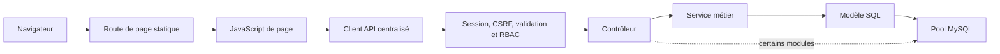

# Audit exhaustif du projet actuel

## Cadre de l'audit

Le présent document décrit exclusivement l'état actuel du code source de l'application. L'analyse couvre le manifeste de dépendances, le point d'entrée serveur, les configurations applicatives, les routes, middlewares, contrôleurs, services, modèles, validations, scripts SQL, vues HTML, ressources CSS/JavaScript et tests présents dans le projet.

L'audit est statique : aucune connexion à la base de données, aucune migration et aucun démarrage du serveur avec ses services externes n'ont été effectués. Par conséquent, le schéma décrit ci-dessous est le schéma déclaré par le code et les scripts SQL ; son état effectif dans une base déployée reste à vérifier dans un environnement autorisé. Les résultats de tests indiqués correspondent uniquement aux tests locaux sans base réelle qui ont effectivement été exécutés pendant l'audit.

Niveaux de confiance employés :

- **Confirmé** : comportement ou structure explicitement présent dans le code ;
- **Observé** : résultat obtenu par une commande locale non destructive ;
- **Non vérifié en exécution intégrée** : dépend d'une base, d'un navigateur ou d'un déploiement non lancé pendant l'audit.

<!-- Sources code : package.json ; server.js ; sql/schema.sql ; sql/migrations/*.sql ; tests/*.test.js -->

## 1. Identité, finalité et périmètre fonctionnel

### 1.1 Identité détectée

Le paquet applicatif se nomme `leoni-planing`, en version `1.0.0`. Le serveur et l'interface emploient le nom « LEONI Planning ». Il s'agit d'une application web interne, monolithique et orientée gestion, destinée à centraliser des comptes utilisateurs, des sélections mensuelles de groupes Home Office, des calendriers de travail à distance, des sessions de travail, des demandes de congé, des indicateurs, des exports et une trace d'audit.

Deux profils métier sont implémentés : `Team Leader` et `Data Cleansing`. Le premier administre et supervise ; le second consulte et génère principalement ses propres données.

<!-- Sources code : package.json (name, version) ; server.js (en-tête et montage des modules) ; config/constants.js (ROLES) ; config/permissions.js (ROLE_PERMISSIONS) ; views/assets/js/layout.js (marque et navigation) -->

### 1.2 Modules effectivement présents

Les modules suffisamment implémentés dans le code actuel sont :

1. authentification par courriel et mot de passe ;
2. session serveur et changement obligatoire du mot de passe initial ;
3. contrôle d'accès par rôles et permissions ;
4. création, consultation, modification et suppression logique d'utilisateurs ;
5. sélection mensuelle d'un groupe Home Office A ou B ;
6. génération et consultation des calendriers Home Office ;
7. suivi des sessions de travail à distance et calcul des heures réelles ;
8. création, consultation, approbation, rejet et annulation de demandes de congé ;
9. tableau de bord et indicateurs de validation ;
10. export du planning en CSV et XLSX ;
11. journalisation applicative, HTTP et métier ;
12. pages d'erreur 403 et 404.

Les « notifications » visibles sont des alertes et toasts calculés dans le navigateur. Aucun module serveur de messagerie, aucune boîte de réception et aucune table de notification ne sont présents. Une permission de paramétrage existe dans la matrice, mais aucune route ni page de paramètres correspondante n'est implémentée.

<!-- Sources code : server.js (routes montées) ; routes/*.js ; controllers/*.js ; services/*.js ; config/permissions.js (SETTINGS_MANAGE) ; views/assets/js/dashboard.js ; views/assets/js/layout.js -->

### 1.3 Organisation du dépôt applicatif

| Répertoire ou fichier | Responsabilité actuelle |
|---|---|
| `server.js` | Initialisation Express, sécurité HTTP, sessions, montage des routes, erreurs et démarrage |
| `config/` | Constantes, permissions, connexion/initialisation MySQL, configuration de navigation |
| `routes/` | Routes de pages et routes API |
| `middlewares/` | Authentification, onboarding, permissions et restitution des erreurs de validation |
| `controllers/` | Adaptation HTTP ; plusieurs contrôleurs exécutent aussi directement du SQL |
| `services/` | Règles métier du planning, des groupes mensuels, des congés et des sessions de travail |
| `models/` | Requêtes SQL des mêmes domaines et modèle utilisateur |
| `validations/` | Règles `express-validator` par ressource |
| `sql/schema.sql` | Schéma relationnel final déclaré |
| `sql/migrations/` | Sept scripts d'évolution numérotés |
| `views/` | Pages HTML statiques et pages 403/404 |
| `views/assets/js/` | Client API, session côté navigateur, shell d'interface et logique de chaque page |
| `views/assets/css/leoni.css` | Thème, composants et règles responsive |
| `tests/` | Tests unitaires ciblés sur la fenêtre de génération et ses gardes |

L'organisation est lisible, mais l'architecture n'est pas parfaitement homogène : les domaines planning, groupe mensuel, congé et session suivent principalement le flux contrôleur → service → modèle, tandis que l'authentification, les utilisateurs, le dashboard, les exports et les logs exécutent du SQL directement dans les contrôleurs.

<!-- Sources code : server.js ; controllers/*.js ; services/*.js ; models/*.js ; routes/*.js ; sql/schema.sql ; tests/*.test.js -->

## 2. Pile technique exacte

### 2.1 Backend, données et outillage

| Technologie | Version déclarée | Rôle observé |
|---|---:|---|
| Node.js | Non déclarée dans `package.json` | Exécution du serveur et des tests `node:test` |
| CommonJS | `type: commonjs` | Système de modules `require`/`module.exports` |
| Express | `^5.2.1` | Serveur HTTP, routes, middleware et fichiers statiques |
| MySQL | Version serveur non déclarée | Stockage relationnel métier et stockage des sessions |
| `mysql2` | `^3.22.5` | Pool de connexions et requêtes préparées par paramètres |
| `express-session` | `^1.19.0` | Session applicative côté serveur |
| `express-mysql-session` | `^3.0.3` | Persistance MySQL des sessions et création automatique de sa table technique |
| `bcrypt` | `^6.0.0` | Hachage et comparaison des mots de passe |
| `express-validator` | `^7.3.2` | Validation des corps, paramètres et requêtes HTTP |
| `csurf` | `^1.11.0` | Protection CSRF fondée sur la session |
| `helmet` | `^8.2.0` | En-têtes de sécurité et politique CSP |
| `express-rate-limit` | `^8.5.2` | Limitation globale des API et limitation renforcée du login |
| `morgan` | `^1.11.0` | Journalisation des requêtes HTTP |
| `dotenv` | `^17.4.2` | Chargement de la configuration d'environnement |
| `exceljs` | `^4.4.0` | Génération des fichiers XLSX |
| `cookie-parser` | `^1.4.7` | Analyse des cookies |
| `nodemon` | `^3.1.14` | Dépendance de développement, sans script dédié effectif |

Le manifeste ne déclare ni moteur Node minimal, ni lint, ni formateur, ni couverture, ni outil de migration. Le champ `main` pointe vers `index.js`, fichier absent, alors que les scripts de démarrage ciblent correctement `server.js`.

<!-- Sources code : package.json ; server.js ; config/db.js -->

### 2.2 Frontend

Le frontend est constitué de HTML, CSS et JavaScript natifs, sans framework SPA ni compilation. Bootstrap `5.3.3` et Font Awesome `6.5.2` sont chargés par CDN dans les pages ; le style métier et responsive est porté par `leoni.css`. Les scripts sont organisés autour de trois briques partagées :

- `api.js` centralise les appels `fetch`, le jeton CSRF, les requêtes JSON et les paramètres d'URL ;
- `auth.js` maintient l'utilisateur courant en mémoire et gère les redirections d'accès ;
- `layout.js` construit dynamiquement le shell, la navigation filtrée, les toasts et les confirmations.

Chaque page charge ensuite un script spécialisé : login, mot de passe, dashboard, utilisateurs, planning, calendrier, congés, export ou logs.

<!-- Sources code : views/*.html ; views/assets/css/leoni.css ; views/assets/js/api.js ; views/assets/js/auth.js ; views/assets/js/layout.js ; views/assets/js/*.js -->

## 3. Architecture et flux d'exécution

### 3.1 Flux HTTP général

Le point d'entrée construit une application Express selon l'ordre suivant : Helmet, journal HTTP, limitations de débit, parsing des cookies et corps, fichiers statiques, magasin de session MySQL, protection CSRF, routes de pages, routes API, gestion 404 puis gestion globale des erreurs.



Les erreurs asynchrones sont relayées par `asyncHandler`. Les erreurs opérationnelles typées conservent leur code HTTP et éventuellement un code métier ; les erreurs inattendues sont journalisées et retournent un message générique sans pile au client.

<!-- Sources code : server.js (ordre des middleware et gestionnaire global) ; utils/asyncHandler.js ; utils/errors.js ; middlewares/validate.js -->

### 3.2 Accès aux données

`config/db.js` crée un pool MySQL de dix connexions, autorise la mise en file d'attente et exporte directement ce pool. À l'import du module, une initialisation asynchrone non attendue :

1. lit et exécute `sql/schema.sql` ;
2. vérifie et ajoute certaines colonnes anciennes si nécessaire ;
3. normalise le type et la valeur par défaut des heures ;
4. recalcule toutes les heures réelles du planning depuis les sessions ;
5. ferme les doublons de sessions actives et ajoute l'unicité correspondante ;
6. crée un compte bootstrap si la table des utilisateurs est vide.

Cette initialisation mélange création de schéma, migrations correctives, mise à jour de données et amorçage. Elle est déclenchée sans `await` global et son exception est capturée puis seulement journalisée ; le serveur peut donc commencer à accepter des requêtes alors que l'initialisation n'est pas terminée ou a échoué. Par ailleurs, le magasin de sessions utilise sa propre configuration de connexion et peut créer automatiquement une table technique distincte.

<!-- Sources code : config/db.js (pool, initializeDatabase) ; sql/schema.sql ; sql/migrations/*.sql ; server.js (sessionStoreOptions, MySQLStore) -->

### 3.3 Architecture transactionnelle

Trois domaines utilisent explicitement des transactions : génération du planning, modification du groupe mensuel et transitions de sessions de travail. La génération et la sélection verrouillent l'utilisateur, puis la sélection mensuelle, avec `FOR UPDATE`. La fenêtre de génération est contrôlée une première fois, puis à nouveau juste avant l'écriture afin de résister au franchissement de minuit métier. La génération vérifie également l'existence d'un planning avant l'insertion en lot.

Les demandes de congé et les opérations utilisateur reposent sur des requêtes isolées. Le contrôle de chevauchement d'un congé et son insertion ne sont donc pas atomiques. Les mises à jour de statut d'un congé incluent néanmoins `WHERE status = 'pending'`, ce qui empêche une seconde décision séquentielle sur une demande déjà traitée.

<!-- Sources code : services/PlanningService.js (generatePlanning) ; services/MonthlyGroupSelectionService.js (saveMine) ; models/Planning.js ; models/MonthlyGroupSelection.js ; services/WorkSessionService.js ; models/LeaveRequest.js -->

## 4. Modèle de données déclaré

### 4.1 Vue relationnelle

Le schéma applicatif déclare six tables métier. Une table technique supplémentaire est créée automatiquement par le magasin de sessions au démarrage ; sa structure n'est pas déclarée dans `sql/schema.sql` et n'est donc pas détaillée ici.

Relations déclarées :

- un utilisateur possède plusieurs sélections mensuelles, lignes de planning, sessions de travail, demandes de congé et logs ;
- une ligne de planning peut posséder plusieurs sessions de travail ;
- une demande de congé référence son demandeur et, après décision, éventuellement son réviseur ;
- un log peut référencer un utilisateur, mais conserve la possibilité d'une valeur nulle ;
- le lien entre `planning` et `monthly_group_selections` est logique sur `(user_id, month_key)` et non matérialisé par une clé étrangère.

<!-- Sources code : sql/schema.sql ; server.js (createDatabaseTable du magasin de session) ; models/Planning.js (jointure mensuelle) -->

### 4.2 Table `users`

**Finalité.** Identité, authentification, rôle, département, état d'onboarding et suppression logique.

| Colonne | Définition déclarée |
|---|---|
| `id` | `INT`, auto-incrément, clé primaire |
| `first_name`, `last_name` | `VARCHAR(50)`, obligatoires |
| `username` | `VARCHAR(50)`, obligatoire, unique |
| `email` | `VARCHAR(100)`, obligatoire, unique |
| `password` | `VARCHAR(255)`, obligatoire, contient le hachage |
| `matricule` | `VARCHAR(50)`, obligatoire, unique |
| `role` | `ENUM('Team Leader','Data Cleansing')`, défaut `Data Cleansing` |
| `department` | `VARCHAR(100)`, obligatoire |
| `group_id` | `TINYINT`, nullable, ancien rattachement global A/B |
| `must_change_password`, `first_login` | indicateurs booléens MySQL, défaut `1` |
| `is_deleted` | indicateur de suppression logique, défaut `0` |
| `deleted_at` | horodatage nullable de suppression |
| `created_at`, `updated_at` | création automatique ; mise à jour automatique pour `updated_at` |

**Index.** Clé primaire ; unicité de `username`, `email` et `matricule` ; index simples sur `group_id`, `role` et `is_deleted`.

**Limites d'intégrité.** Aucun `CHECK` ne borne `group_id` ni les trois indicateurs booléens. La validation HTTP autorise un courriel jusqu'à 255 caractères alors que la colonne en accepte 100. Le groupe mensuel courant est désormais stocké dans une autre table, mais plusieurs lectures utilisent encore `users.group_id`.

<!-- Sources code : sql/schema.sql (users) ; validations/userValidation.js ; models/User.js ; controllers/userController.js ; controllers/authController.js -->

### 4.3 Table `monthly_group_selections`

**Finalité.** Conserver le groupe A ou B choisi par utilisateur et par mois.

| Colonne | Définition déclarée |
|---|---|
| `id` | `INT`, auto-incrément, clé primaire |
| `user_id` | `INT`, obligatoire, FK vers `users.id`, suppression en cascade |
| `month_key` | `CHAR(7)`, obligatoire, commentaire de format `YYYY-MM` |
| `group_id` | `TINYINT`, obligatoire, `CHECK` limité à `1` ou `2` |
| `created_at`, `updated_at` | horodatages automatiques |

**Index et contraintes.** Unicité `(user_id, month_key)` ; index sur `month_key`, `group_id` et `(month_key, group_id)` ; FK avec `ON DELETE CASCADE`.

**Limites d'intégrité.** Le format de `month_key` est contrôlé par l'application mais pas par une contrainte SQL. Aucune FK ne rattache directement cette sélection aux lignes de planning du même mois. Le verrouillage après génération est une règle de service, pas une contrainte de base.

<!-- Sources code : sql/schema.sql (monthly_group_selections) ; sql/migrations/007_create_monthly_group_selections.sql ; models/MonthlyGroupSelection.js ; services/MonthlyGroupSelectionService.js -->

### 4.4 Table `planning`

**Finalité.** Représenter les jours planifiés et les heures associées à un utilisateur.

| Colonne | Définition déclarée |
|---|---|
| `id` | `INT`, auto-incrément, clé primaire |
| `user_id` | `INT`, obligatoire, FK vers `users.id`, suppression en cascade |
| `date` | `DATE`, obligatoire |
| `status` | `ENUM('onsite','remote')`, défaut `remote` |
| `month_key` | `VARCHAR(7)`, obligatoire |
| `work_hour` | `DECIMAL(5,2)`, heures réelles, défaut `0.00` |
| `planned_work_hour` | `DECIMAL(5,2)`, durée prévue, défaut `8.00` |
| `horaire` | `VARCHAR(50)`, nullable, explicitement défini comme placeholder |
| `created_at`, `updated_at` | horodatages automatiques |

**Index et contraintes.** Unicité `(user_id, date)` ; index sur `month_key` ; FK utilisateur avec `ON DELETE CASCADE`.

**Sémantique actuelle.** Le générateur insère uniquement des lignes `remote`, avec `work_hour = 0` et `planned_work_hour = 8`. `work_hour` est ensuite recalculé depuis les sessions et plafonné à huit heures. `horaire` est lu et affiché, mais aucune logique actuelle ne le calcule ni ne l'écrit.

**Limites d'intégrité.** Aucun `CHECK` n'impose la cohérence entre `date` et `month_key`, ni des bornes aux heures. Le groupe n'est pas figé dans le planning : il est retrouvé par jointure logique avec la sélection mensuelle.

<!-- Sources code : sql/schema.sql (planning) ; sql/migrations/003_add_horaire_to_planning.sql ; sql/migrations/005_harden_work_sessions_and_work_hours.sql ; models/Planning.js ; services/PlanningService.js ; models/WorkSession.js -->

### 4.5 Table `work_sessions`

**Finalité.** Enregistrer les périodes d'activité liées au travail à distance.

| Colonne | Définition déclarée |
|---|---|
| `id` | `INT`, auto-incrément, clé primaire |
| `user_id` | `INT`, obligatoire, FK utilisateur, suppression en cascade |
| `planning_id` | `INT`, nullable, FK planning, mise à `NULL` si le planning disparaît |
| `work_date` | `DATE`, obligatoire |
| `started_at` | `DATETIME`, obligatoire |
| `last_heartbeat_at`, `ended_at` | `DATETIME`, nullables |
| `active_seconds` | `INT`, obligatoire, défaut `0` |
| `status` | `ENUM('active','paused','ended','expired')`, défaut `active` |
| `active_slot` | `TINYINT`, `1` pendant l'activité et `NULL` dans l'historique selon l'application |
| `created_at`, `updated_at` | `DATETIME` automatiques |

**Index et contraintes.** Index `(user_id, work_date)`, `planning_id`, `status`, `last_heartbeat_at` ; unicité `(user_id, planning_id, work_date, active_slot)` ; FK utilisateur en cascade et FK planning avec `ON DELETE SET NULL`.

**Portée réelle de l'unicité.** Pour un `planning_id` non nul et `active_slot = 1`, une seule session active est admise pour le triplet utilisateur/planning/date. Comme MySQL permet plusieurs valeurs `NULL` dans un index unique, cette garantie ne couvre pas des sessions actives dont `planning_id` serait nul. Le code applicatif courant crée toutefois une session à partir d'un planning existant.

**Limites d'intégrité.** Aucun `CHECK` ne lie `active_slot` au statut, ne garantit `active_seconds >= 0`, n'impose l'ordre des horodatages, ni la cohérence entre utilisateur, planning et date dupliqués.

<!-- Sources code : sql/schema.sql (work_sessions) ; sql/migrations/004_create_work_sessions.sql ; sql/migrations/005_harden_work_sessions_and_work_hours.sql ; models/WorkSession.js ; services/WorkSessionService.js -->

### 4.6 Table `leave_requests`

**Finalité.** Stocker une demande de congé et sa décision.

| Colonne | Définition déclarée |
|---|---|
| `id` | `INT`, auto-incrément, clé primaire |
| `user_id` | `INT`, demandeur obligatoire, FK avec suppression en cascade |
| `start_date`, `end_date` | `DATE`, obligatoires |
| `leave_type` | `VARCHAR(50)`, obligatoire |
| `reason` | `TEXT`, nullable |
| `status` | `ENUM('pending','approved','rejected','cancelled')`, défaut `pending` |
| `decision_comment` | `TEXT`, nullable |
| `reviewed_by` | `INT`, réviseur nullable, FK avec `ON DELETE SET NULL` |
| `reviewed_at` | `TIMESTAMP`, nullable |
| `created_at`, `updated_at` | horodatages automatiques |

**Index.** `user_id`, `status`, `(user_id, status, start_date, end_date)` et `(start_date, end_date)`.

**Limites d'intégrité.** Le type de congé, l'ordre des dates, l'absence de chevauchement, l'interdiction d'auto-révision et la cohérence décision/statut sont validés uniquement dans l'application. Deux créations concurrentes peuvent donc franchir simultanément le contrôle de chevauchement. Aucun solde, calendrier de jours ouvrés ou lien avec le planning n'est stocké.

<!-- Sources code : sql/schema.sql (leave_requests) ; sql/migrations/002_create_leave_requests.sql ; models/LeaveRequest.js ; services/LeaveRequestService.js ; validations/leaveRequestValidation.js -->

### 4.7 Table `audit_logs`

**Finalité.** Tracer des événements métier.

| Colonne | Définition déclarée |
|---|---|
| `id` | `INT`, auto-incrément, clé primaire |
| `user_id` | `INT`, nullable, FK utilisateur avec `ON DELETE SET NULL` |
| `action` | `VARCHAR(50)`, obligatoire |
| `details` | `TEXT`, nullable |
| `ip_address` | `VARCHAR(45)`, nullable |
| `created_at` | `TIMESTAMP`, création automatique |

**Index.** Index sur `created_at` et `action` ; la FK garantit la référence quand `user_id` est non nul.

**Limites.** Les détails sont des chaînes libres, sans schéma structuré. L'insertion est « best effort » : son exception est absorbée après journalisation, de sorte qu'une action métier peut réussir sans trace d'audit. La consultation retourne les 100 dernières lignes, sans pagination, filtre, politique de rétention ni affichage de l'adresse IP.

<!-- Sources code : sql/schema.sql (audit_logs) ; sql/migrations/001_add_enterprise_columns.sql ; utils/logger.js ; controllers/logController.js ; config/constants.js (AUDIT_ACTIONS) -->

### 4.8 Table technique de sessions

Le magasin `express-mysql-session` est configuré avec `createDatabaseTable: true`, nettoyage périodique des sessions expirées et expiration alignée sur huit heures. Le code applicatif ne déclare ni la structure de cette table dans `schema.sql`, ni une relation avec `users`. Son contenu et sa structure réels ne sont donc pas affirmés dans cet audit statique.

Conséquence fonctionnelle confirmée par le code : le rôle et les indicateurs d'onboarding sont copiés dans la session lors du login ; les middlewares autorisent ensuite sur la base de cette session, sans relire l'utilisateur en base à chaque requête.

<!-- Sources code : server.js (sessionStoreOptions et express-session) ; controllers/authController.js (sessionUserPayload) ; middlewares/auth.js -->

### 4.9 Synthèse des relations et suppressions

| Parent | Enfant | Cardinalité logique | Suppression déclarée |
|---|---|---|---|
| `users` | `monthly_group_selections` | 1 → N | `CASCADE` |
| `users` | `planning` | 1 → N | `CASCADE` |
| `users` | `work_sessions` | 1 → N | `CASCADE` |
| `planning` | `work_sessions` | 1 → N | `SET NULL` |
| `users` demandeur | `leave_requests` | 1 → N | `CASCADE` |
| `users` réviseur | `leave_requests` | 1 → N optionnel | `SET NULL` |
| `users` | `audit_logs` | 1 → N optionnel | `SET NULL` |
| sélection mensuelle | planning | 1 → N logique par utilisateur/mois | aucune FK |

L'application ne supprime normalement pas physiquement un utilisateur : elle positionne `is_deleted` et `deleted_at`. Les cascades ci-dessus ne s'activent donc que lors d'une suppression SQL physique externe au flux normal.

<!-- Sources code : sql/schema.sql (FOREIGN KEY) ; controllers/userController.js (deleteUser) ; models/User.js (softDelete) -->

### 4.10 Inventaire des migrations

| Migration | Effet déclaré |
|---|---|
| `001_add_enterprise_columns.sql` | ajoute la suppression logique et les horodatages manquants, enrichit les audits avec l'adresse IP et un champ `TEXT`, puis ajoute des index de rôle/suppression/action |
| `002_create_leave_requests.sql` | crée la table des demandes de congé, ses deux FK et ses index |
| `003_add_horaire_to_planning.sql` | ajoute le placeholder nullable `planning.horaire` |
| `004_create_work_sessions.sql` | convertit `planning.work_hour` en décimal puis crée les sessions de travail et leurs index/FK |
| `005_harden_work_sessions_and_work_hours.sql` | sépare heures prévues/réelles, recalcule les heures, ajoute `active_slot`, expire les doublons actifs et crée l'index unique |
| `006_add_updated_at_to_planning.sql` | ajoute l'horodatage automatique de modification du planning |
| `007_create_monthly_group_selections.sql` | crée les sélections mensuelles, sans recopier l'ancien `users.group_id` |

Les scripts utilisent majoritairement des interrogations `INFORMATION_SCHEMA` pour éviter de recréer colonnes ou index. La migration 005 exécute toutefois un `ALTER` et des mises à jour de données même lorsqu'elle est rejouée. Aucun registre de versions appliquées, aucune commande de migration dans `package.json` et aucun orchestrateur de ces sept fichiers ne sont présents ; l'initialisation au démarrage reproduit seulement une partie de leur logique.

<!-- Sources code : sql/migrations/001_add_enterprise_columns.sql ; sql/migrations/002_create_leave_requests.sql ; sql/migrations/003_add_horaire_to_planning.sql ; sql/migrations/004_create_work_sessions.sql ; sql/migrations/005_harden_work_sessions_and_work_hours.sql ; sql/migrations/006_add_updated_at_to_planning.sql ; sql/migrations/007_create_monthly_group_selections.sql ; package.json ; config/db.js -->

## 5. Routes, contrôleurs et services

### 5.1 Routes de pages

| Route | Protection | Vue servie |
|---|---|---|
| `/` | aucune | redirection vers `/login` |
| `/login` | redirige si déjà connecté | `login.html` |
| `/change-password` | session authentifiée | `change-password.html` |
| `/dashboard` | auth + onboarding | `dashboard.html` |
| `/users-page` | auth + onboarding + `users.read` | `users.html` |
| `/planning-page` | auth + onboarding | `planning.html` |
| `/calendar-page` | auth + onboarding + `planning.read.own` | `calendar.html` |
| `/leave-requests-page` | auth + onboarding + `leave_requests.read.own` | `leave-requests.html` |
| `/export-page` | auth + onboarding + `export.csv` | `export.html` |
| `/logs-page` | auth + onboarding + `audit.read` | `logs.html` |

La protection côté page complète, mais ne remplace pas, les contrôles des API. Les pages sont des coquilles statiques ; leur contenu fonctionnel est injecté par JavaScript après vérification de session.

<!-- Sources code : routes/viewRoutes.js ; views/*.html ; views/assets/js/auth.js ; views/assets/js/layout.js -->

### 5.2 Inventaire exhaustif des API

| Domaine | Méthode et route | Garde principale | Traitement |
|---|---|---|---|
| CSRF | `GET /api/auth/csrf-token` | session CSRF | fournit un jeton |
| Auth | `GET /api/auth/session` | aucune auth obligatoire | retourne l'utilisateur de session ou `null` |
| Auth | `POST /api/auth/login` | validation + limite login | authentifie par courriel |
| Auth | `POST /api/auth/logout` | session éventuelle | détruit la session |
| Auth | `POST /api/auth/change-password` | auth + validation | vérifie l'ancien mot de passe et remplace le hachage |
| Utilisateurs | `GET /api/users` | `users.read` | liste les actifs |
| Utilisateurs | `POST /api/users` | `users.create` + validation | crée un compte |
| Utilisateurs | `PUT /api/users/:id` | `users.update` + validation | modifie identité métier et rôle |
| Utilisateurs | `DELETE /api/users/:id` | `users.delete` + validation | suppression logique |
| Planning | `GET /api/planning/generation-window` | `planning.generate.own` | expose la fenêtre serveur |
| Planning | `POST /api/planning/generate` | `planning.generate.own`, puis contrôle de cible | génère un mois |
| Planning | `GET /api/planning/calendar` | auth + onboarding | calendriers, périmètre appliqué par service |
| Planning | `GET /api/planning` | auth + onboarding + validation des filtres | recherche filtrée |
| Planning | `GET /api/planning/all` | auth + onboarding | liste selon le rôle |
| Planning | `GET /api/planning/:user_id` | auth + onboarding | utilisateur ciblé, contrôle par service |
| Groupes | `GET /api/monthly-group-selections/mine` | lecture propre + validation | sélection propre |
| Groupes | `PUT /api/monthly-group-selections/mine` | écriture propre + validation | crée ou modifie la sélection |
| Groupes | `GET /api/monthly-group-selections` | lecture globale + validation | état des employés pour un mois |
| Sessions | `POST /api/work-sessions/auto-start` | lecture planning propre + validation | démarre/reprend si disponible |
| Sessions | `POST /api/work-sessions/heartbeat` | lecture planning propre + validation | comptabilise ou met en pause |
| Sessions | `POST /api/work-sessions/pause` | lecture planning propre + validation | met en pause |
| Sessions | `POST /api/work-sessions/end` | lecture planning propre + validation | termine |
| Sessions | `GET /api/work-sessions/mine` | lecture planning propre + validation | résumé quotidien propre |
| Sessions | `GET /api/work-sessions/summary` | `work_sessions.read.summary` + validation | synthèse mensuelle globale |
| Congés | `GET /api/leave-requests/mine` | lecture propre | demandes propres |
| Congés | `POST /api/leave-requests` | lecture propre + validation | crée une demande |
| Congés | `PATCH /api/leave-requests/:id/cancel` | lecture propre + validation | annule sa demande en attente |
| Congés | `GET /api/leave-requests` | `leave_requests.manage` | demandes des utilisateurs actifs |
| Congés | `PATCH /api/leave-requests/:id/approve` | gestion + validation | approuve |
| Congés | `PATCH /api/leave-requests/:id/reject` | gestion + validation | rejette |
| Dashboard | `GET /api/dashboard/stats` | auth + onboarding | indicateurs d'un mois |
| Export | `GET /api/export/csv` | `export.csv` | export CSV |
| Export | `GET /api/export/xlsx` | `export.xlsx` | export XLSX |
| Audit | `GET /api/logs` | `audit.read` | 100 dernières traces |

Les contrôles CSRF et le rate limit API global sont appliqués en amont à l'échelle du serveur. Les quatre routes de lecture du planning et la route de statistiques n'emploient pas explicitement les permissions pourtant définies pour ces actions ; leur périmètre est principalement assuré par l'authentification, le rôle et les filtres du service.

<!-- Sources code : server.js ; routes/authRoutes.js ; routes/userRoutes.js ; routes/planningRoutes.js ; routes/monthlyGroupSelectionRoutes.js ; routes/workSessionRoutes.js ; routes/leaveRequestRoutes.js ; routes/dashboardRoutes.js ; routes/exportRoutes.js ; routes/logRoutes.js -->

## 6. Rôles et autorisations

### 6.1 Matrice de permissions

| Domaine | Team Leader | Data Cleansing |
|---|---|---|
| Dashboard | lecture + statistiques | lecture |
| Utilisateurs | lire, créer, modifier, supprimer | aucune permission |
| Planning | lire propre/tous, générer propre/pour tous | lire propre, générer propre |
| Groupe mensuel | lire/écrire le sien, lire tous | lire/écrire le sien |
| Sessions de travail | lire le résumé global | aucune permission globale ; gestion propre via permission planning |
| Congés | lire les siens + gérer tous | lire les siens |
| Export | CSV + XLSX | aucune permission |
| Audit | lecture | aucune permission |
| Paramètres | permission déclarée | aucune permission |

La permission `settings.manage` n'est reliée à aucune route actuelle. La permission `dashboard.statistics` n'est pas appliquée par `dashboardRoutes.js`. Les permissions de lecture globale du planning ne sont pas posées directement sur toutes les routes ; `PlanningService` limite néanmoins les non-Team-Leader à leur identifiant.

<!-- Sources code : config/permissions.js ; routes/dashboardRoutes.js ; routes/planningRoutes.js ; services/PlanningService.js -->

### 6.2 Chaîne d'autorisation

`auth` vérifie la présence de `req.session.user`. `requireOnboardingComplete` bloque tout utilisateur dont `first_login` ou `must_change_password` est vrai. `requirePermission` recherche ensuite la permission dans la matrice du rôle stocké en session. Le frontend filtre également sa navigation avec la liste de permissions fournie par le backend, mais ce filtrage n'est qu'une aide d'interface.

Le rôle est copié dans la session au login et n'est pas relu en base à chaque requête. Une suppression logique ou une modification de rôle ne révoque donc pas immédiatement une session déjà ouverte. `getSession` recalcule les permissions à partir du rôle de session, mais ne recharge pas ce rôle depuis `users`.

<!-- Sources code : middlewares/auth.js ; controllers/authController.js (sessionUserPayload, getSession) ; config/permissions.js ; views/assets/js/auth.js ; views/assets/js/layout.js -->

## 7. Audit fonctionnel par module

### 7.1 Authentification et mot de passe

**Acteurs.** Tous les utilisateurs déclarés et non supprimés.

**Entrées.** Courriel et mot de passe au login ; ancien, nouveau et confirmation au changement.

**Traitement.** Le contrôleur recherche un utilisateur actif par courriel, compare le mot de passe avec bcrypt, copie l'identité utile et les permissions dans la session, puis redirige vers le changement de mot de passe si nécessaire. Le changement vérifie l'ancien secret, exige au moins huit caractères pour le nouveau, rehache et désactive les indicateurs de première connexion.

**Sorties.** Session MySQL, cookie `httpOnly`, réponse JSON et redirection de page.

**Limites confirmées.** Le login ne prend pas le nom d'utilisateur. Les réponses distinguent « utilisateur absent » et « mot de passe incorrect », ce qui permet de différencier les comptes. La session n'est pas régénérée explicitement après authentification. Il n'existe ni mot de passe oublié, ni réinitialisation par Team Leader ; la méthode `User.updatePassword` n'est appelée par aucune route.

<!-- Sources code : validations/authValidation.js ; controllers/authController.js ; routes/authRoutes.js ; models/User.js (updatePassword) ; server.js (session) ; views/assets/js/login.js ; views/assets/js/change-password.js -->

### 7.2 Gestion des utilisateurs

**Acteur.** Team Leader.

**Actions.** Liste des comptes actifs, création, modification de prénom/nom/rôle/matricule/département et suppression logique.

**Validations.** Champs obligatoires, longueurs, format de courriel, mot de passe initial de 8 à 200 caractères et rôle limité aux deux valeurs. La création vérifie les conflits de courriel, nom d'utilisateur et matricule, y compris parmi les comptes supprimés.

**Entité.** `users`, avec journalisation métier après chaque mutation.

**Limites confirmées.** Aucune restauration n'est exposée malgré une constante d'audit `RESTORE_USER`. La modification ne pré-vérifie pas le conflit de matricule et laisse la contrainte SQL produire l'erreur. Les comptes supprimés restent titulaires de leurs lignes historiques, mais une session déjà ouverte n'est pas invalidée. Les listes ne sont ni paginées ni recherchables côté serveur.

<!-- Sources code : routes/userRoutes.js ; controllers/userController.js ; validations/userValidation.js ; models/User.js ; config/constants.js (AUDIT_ACTIONS) ; views/assets/js/users.js -->

### 7.3 Sélection mensuelle et génération du planning

**Acteurs.** Les deux rôles peuvent sélectionner leur propre groupe et générer leur propre planning ; le Team Leader peut aussi générer pour un autre utilisateur disposant d'une sélection mensuelle.

**Entrées.** Mois `YYYY-MM`, groupe `1`/`2`, éventuellement utilisateur cible et filtres mois/groupe/nom.

**Traitement.** Le service calcule une fenêtre métier avec l'heure UTC de la base convertie en `Africa/Tunis`. Entre le 25 et le dernier jour inclus, seul le mois immédiatement suivant est accepté. Une sélection A ou B de ce même mois est obligatoire. Le planning est ensuite généré en lot selon les jours du groupe et ne peut être régénéré si une ligne existe déjà pour l'utilisateur et le mois.

**Sorties.** Lignes de planning, calendriers regroupés par utilisateur/mois, liste filtrée, état des sélections et messages avec codes métier.

**Entités.** `users`, `monthly_group_selections`, `planning`, puis `audit_logs`.

**Limites confirmées.** Le groupe est joint dynamiquement et non figé dans le planning. `status='onsite'` est prévu par le schéma mais aucune génération actuelle ne l'emploie. `horaire` reste vide. Un planning partiel existant bloque toute génération complète du mois.

<!-- Sources code : routes/planningRoutes.js ; routes/monthlyGroupSelectionRoutes.js ; controllers/planningController.js ; services/PlanningService.js ; services/PlanningGenerationWindowService.js ; services/MonthlyGroupSelectionService.js ; models/Planning.js ; models/MonthlyGroupSelection.js -->

### 7.4 Sessions de travail et heures

**Acteurs.** Utilisateur connecté pour ses propres sessions ; Team Leader pour le résumé mensuel global.

**Disponibilité.** Le suivi automatique n'est disponible que si le planning appartient au demandeur, correspond à la date serveur et porte le statut `remote`.

**Cycle.** Démarrage ou reprise → heartbeats → pause éventuelle → reprise ou fin. Une session active inactive au-delà du délai de grâce est expirée par les appels métier ou par un nettoyage planifié. Les transitions et recalculs sont transactionnels et verrouillent la session concernée.

**Calcul.** Chaque heartbeat ajoute au maximum 120 secondes depuis le dernier repère. Le cumul brut de la journée est conservé ; la valeur reportée dans `planning.work_hour` est arrondie à deux décimales et plafonnée à huit heures. `planned_work_hour` vaut huit heures par défaut mais n'est pas utilisé comme plafond dynamique : le plafond vient d'une constante globale.

**Limites confirmées.** Le résumé de groupe filtre `users.group_id`, alors que le planning et le dashboard utilisent `monthly_group_selections.group_id`. Les utilisateurs créés actuellement n'alimentent pas ce groupe historique ; le filtre de résumé peut donc être vide ou incohérent. La date du serveur de sessions vient de `NOW()/CURDATE()` sans réglage explicite de fuseau dans le pool, contrairement à la fenêtre de planning. Une session commencée avant minuit n'est pas explicitement bloquée lors d'un heartbeat après changement de date. Aucun test automatisé du domaine n'est présent.

<!-- Sources code : routes/workSessionRoutes.js ; controllers/workSessionController.js ; services/WorkSessionService.js ; models/WorkSession.js ; config/constants.js (WORK_SESSION_*, WORK_SESSION_MAX_DAILY_SECONDS) ; server.js (startStaleSessionCleanup) -->

### 7.5 Demandes de congé

**Acteurs.** Les deux rôles créent, lisent et annulent leurs propres demandes ; le Team Leader lit toutes les demandes actives et décide celles des autres.

**Entrées.** Dates valides, type parmi `annual`, `sick`, `exceptional`, `unpaid`, `other`, motif facultatif et commentaire de décision facultatif ; les textes sont limités à 500 caractères par le service et les validations.

**Règles.** Date de début ≤ date de fin ; absence de chevauchement avec une demande `pending` ou `approved` ; seule une demande `pending` peut être annulée, approuvée ou rejetée ; le réviseur ne peut pas être le demandeur.

**Sorties.** Demandes enrichies du nom, matricule, département et réviseur, triées par date ou priorité de statut ; traces d'audit après mutation.

**Limites confirmées.** Pas de solde, durée calculée, jours ouvrés, justificatif, délégation ni synchronisation avec le planning. Le chevauchement est contrôlé avant l'insertion sans transaction ni contrainte SQL. Les demandes d'un utilisateur supprimé logiquement sont masquées par la jointure filtrée.

<!-- Sources code : routes/leaveRequestRoutes.js ; controllers/leaveRequestController.js ; services/LeaveRequestService.js ; models/LeaveRequest.js ; validations/leaveRequestValidation.js ; config/constants.js (LEAVE_TYPES, LEAVE_REQUEST_STATUS) -->

### 7.6 Dashboard et alertes

**Données.** Nombre total d'utilisateurs actifs, nombre d'employés Data Cleansing, répartitions mensuelles A/B, nombre total de lignes de planning, nombre d'employés ayant un planning pour le mois et taux de validation.

**Affichage.** Le Data Cleansing voit une alerte verte, orange ou rouge selon la présence de son planning et le jour courant. Le Team Leader voit le taux de validation et un tableau de suivi des employés, de leur sélection mensuelle et de leur statut.

**Limites confirmées.** Le mois cible est recalculé dans le navigateur à partir de son horloge locale, tandis que l'API emploie également une aide serveur fondée sur l'horloge Node et que la génération utilise une horloge DB convertie en fuseau métier. Ces sources peuvent diverger près d'une frontière de jour ou de mois. Les alertes ne sont ni persistées, ni envoyées, ni historisées. La route de statistiques ne valide pas son paramètre `month` et n'applique pas les permissions dashboard déclarées.

<!-- Sources code : controllers/dashboardController.js ; routes/dashboardRoutes.js ; utils/helpers.js (getTargetMonthKey) ; views/assets/js/dashboard.js ; config/permissions.js -->

### 7.7 Exports

**Acteur.** Team Leader via les permissions CSV/XLSX.

**Filtres.** Groupe mensuel, utilisateur et mois. La requête exclut les utilisateurs supprimés et joint la sélection sur utilisateur/mois.

**Formats.** CSV UTF-8 avec BOM et échappement des virgules, guillemets et retours à la ligne ; XLSX avec colonnes ID, utilisateur, matricule, nom, date distante et heures réelles.

**Limites confirmées.** Les filtres API ne passent par aucune validation dédiée. Toutes les lignes correspondantes sont chargées en mémoire et exportées sans pagination. Le CSV protège sa structure, mais ne neutralise pas les préfixes interprétables comme formules par un tableur. Les détails affichés dans la page mentionnent deux anciens chemins qui ne correspondent pas aux routes réellement appelées.

<!-- Sources code : routes/exportRoutes.js ; controllers/exportController.js ; views/assets/js/api.js (exportPlanning, exportPlanningXlsx) ; views/assets/js/export.js -->

### 7.8 Audit et observabilité

Trois canaux existent : Morgan pour les requêtes HTTP, `appLogger` pour des messages JSON de niveaux DEBUG/INFO/WARN/ERROR, et `logAction` pour les actions métier en base. Les actions couvrent notamment login/logout, mots de passe, utilisateurs, planning, congés, exports, sessions et sélections mensuelles.

La lecture des logs métier est réservée au Team Leader et limitée aux 100 plus récents. Les échecs de login ne sont pas ajoutés à `audit_logs`. Le logger métier absorbe ses erreurs ; en outre, certains logs d'heures sont écrits via une connexion séparée pendant une transaction de session, donc sans atomicité garantie avec la mutation principale.

<!-- Sources code : server.js (morgan) ; utils/appLogger.js ; utils/logger.js ; config/constants.js (AUDIT_ACTIONS) ; controllers/logController.js ; services/WorkSessionService.js -->

## 8. Règles métier confirmées

### 8.1 Fenêtre mensuelle

- fuseau métier : `Africa/Tunis` ;
- instant d'autorité : `UTC_TIMESTAMP()` fourni par MySQL, puis conversion applicative ;
- fenêtre ouverte du 25 au dernier jour réel du mois inclus ;
- mois autorisé : uniquement le mois immédiatement suivant ;
- prise en charge des mois de 28, 29, 30 et 31 jours et du passage décembre → janvier ;
- contrôle répété juste avant l'écriture pour la sélection et la génération.

<!-- Sources code : config/constants.js (BUSINESS_TIMEZONE, PLANNING_WINDOW_DAY) ; models/Planning.js (getAuthoritativeUtcClock) ; utils/planningGenerationWindow.js ; services/PlanningGenerationWindowService.js ; tests/planningGenerationWindow.test.js -->

### 8.2 Répartition des jours Home Office

- **Groupe A** : mercredi et jeudi chaque semaine ; premier, troisième et cinquième vendredi du mois ;
- **Groupe B** : lundi et mardi chaque semaine ; deuxième et quatrième vendredi du mois ;
- chaque jour généré reçoit le statut `remote` ;
- les vendredis sont indexés par leur ordre d'apparition dans le mois, et non par numéro ISO de semaine.

<!-- Sources code : services/PlanningService.js (calculateHomeOfficeDays) ; config/constants.js (PLANNING_STATUS) -->

### 8.3 Sélection et unicité du planning

- une sélection mensuelle A/B est obligatoire avant génération ;
- une seule sélection par utilisateur et mois est admise par la base ;
- après existence d'un planning pour le mois, un changement vers l'autre groupe est refusé par le service ;
- toute ligne existante pour l'utilisateur/mois empêche une nouvelle génération complète ;
- une seule ligne de planning par utilisateur/date est admise par la base ;
- les utilisateurs supprimés logiquement sont exclus des lectures et ne peuvent être ciblés par la génération.

<!-- Sources code : services/MonthlyGroupSelectionService.js ; services/PlanningService.js ; models/MonthlyGroupSelection.js ; models/Planning.js ; sql/schema.sql (contraintes uniques) -->

### 8.4 Heures réelles et sessions

- suivi possible uniquement pour le planning `remote` du jour et de son propriétaire ;
- heartbeat nominal côté client toutes les 60 secondes ;
- délai de grâce comptabilisé maximal de 120 secondes entre deux repères ;
- nettoyage des sessions obsolètes planifié toutes les deux minutes, avec un premier passage après une seconde ;
- cumul quotidien brut conservé, mais heures du planning plafonnées à 28 800 secondes, soit huit heures ;
- valeur du planning arrondie à deux décimales ;
- une session active par utilisateur/planning/date garantie pour les lignes conformes avec `active_slot = 1`.

La constante d'inactivité de cinq minutes est déclarée mais n'est pas utilisée par le service actuel ; l'expiration effective se fonde sur le délai de grâce de 120 secondes.

<!-- Sources code : config/constants.js (WORK_SESSION_*) ; services/WorkSessionService.js ; models/WorkSession.js ; sql/schema.sql (uq_work_sessions_active) ; views/assets/js/planning.js -->

### 8.5 Congés

- cinq types applicatifs autorisés ;
- dates calendaires ISO valides et plage non inversée ;
- motif et commentaire de décision facultatifs, 500 caractères maximum ;
- chevauchement refusé seulement avec les statuts `pending` ou `approved` ;
- transition de `pending` vers `approved`, `rejected` ou `cancelled` ;
- annulation limitée au propriétaire ;
- approbation/rejet réservés au gestionnaire et interdits sur sa propre demande.

<!-- Sources code : config/constants.js (LEAVE_TYPES, LEAVE_REQUEST_STATUS) ; validations/leaveRequestValidation.js ; services/LeaveRequestService.js ; models/LeaveRequest.js -->

### 8.6 Utilisateurs et suppression logique

- rôle limité à deux valeurs dans l'application et dans l'ENUM SQL ;
- nouveaux comptes marqués première connexion et changement de mot de passe obligatoire ;
- unicité durable du courriel, nom d'utilisateur et matricule, y compris après suppression logique ;
- suppression logique par `is_deleted = 1` et `deleted_at = NOW()` ;
- filtres `is_deleted = 0` appliqués à l'authentification et aux principales lectures métier.

<!-- Sources code : config/constants.js (ROLES) ; sql/schema.sql (users) ; validations/userValidation.js ; controllers/userController.js ; controllers/authController.js ; models/User.js -->

## 9. Sécurité et robustesse

### 9.1 Mécanismes présents

| Mécanisme | Implémentation confirmée |
|---|---|
| Hachage | bcrypt asynchrone, coût 10 |
| Session | magasin MySQL, durée maximale huit heures |
| Cookie | `httpOnly`, `sameSite=lax`, `secure` en production |
| CSRF | middleware global `csurf`, jeton récupéré par le client API |
| En-têtes | Helmet avec CSP restreinte et CDN explicitement autorisés |
| Brute force | limite login distincte et limite globale API |
| RBAC | matrice rôle → permissions, middleware backend et navigation filtrée |
| Validation | `express-validator` sur les principales mutations et recherches |
| SQL | paramètres `?`/tableaux pour les valeurs ; fragments dynamiques construits depuis des conditions internes |
| Erreurs | classes opérationnelles et message générique pour erreur inattendue |
| Audit | traces métier avec utilisateur, action, détails, adresse IP et date |
| Secrets de configuration | variables obligatoires vérifiées avant démarrage du serveur |

<!-- Sources code : server.js ; config/constants.js ; config/permissions.js ; middlewares/auth.js ; middlewares/validate.js ; validations/*.js ; controllers/*.js ; models/*.js ; utils/errors.js ; utils/logger.js -->

### 9.2 Risques de sécurité confirmés par le code

1. **Amorçage sensible.** Un compte bootstrap utilise des informations fixes codées dans `config/db.js`, et un message de log reproduit les informations de connexion initiales. Les valeurs ne sont volontairement pas reprises dans ce rapport.
2. **Valeurs de validation non expurgées.** `validate.js` journalise et retourne `errors.array()` sans retirer les valeurs ; pour les validations de mots de passe, la valeur reçue peut donc être incluse dans les objets d'erreur.
3. **Session non revalidée.** Le rôle et l'état utilisateur restent ceux de la session après modification ou suppression logique du compte.
4. **Énumération au login.** Le statut/message diffère entre compte absent et mot de passe erroné.
5. **Pas de régénération explicite de session.** Le login affecte directement `req.session.user`.
6. **Audit incomplet.** Les échecs d'authentification ne sont pas audités et les échecs d'insertion d'audit n'empêchent pas l'action.
7. **CSV.** Les cellules textuelles ne sont pas neutralisées contre l'interprétation de formules par les tableurs.

<!-- Sources code : config/db.js (amorçage) ; middlewares/validate.js ; validations/authValidation.js ; controllers/authController.js ; middlewares/auth.js ; utils/logger.js ; controllers/exportController.js -->

### 9.3 Robustesse de l'initialisation et des migrations

Le schéma final utilise `CREATE TABLE IF NOT EXISTS`, mais cela ne met pas à niveau une table préexistante. Sept migrations SQL existent, sans table de version ni exécuteur identifié. En parallèle, `initializeDatabase` implémente un sous-ensemble ad hoc de migrations et effectue des mises à jour de données à chaque démarrage.

Le pool est configuré avec le nom d'une base déjà attendu lors de la connexion ; l'instruction de création de base présente dans `schema.sql` ne peut pas aider si la connexion initiale échoue précisément parce que la base n'existe pas. L'erreur d'initialisation est absorbée et le serveur n'attend pas un état « prêt » avant d'écouter.

<!-- Sources code : config/db.js (createPool, initializeDatabase) ; sql/schema.sql ; sql/migrations/001_add_enterprise_columns.sql à 007_create_monthly_group_selections.sql ; server.js (app.listen) -->

### 9.4 Cohérence temporelle et métier

La génération mensuelle emploie une heure UTC de base convertie explicitement au fuseau `Africa/Tunis`. Les sessions de travail utilisent `NOW()` et `CURDATE()` de MySQL sans option de fuseau visible dans le pool. Le dashboard emploie l'horloge du navigateur et l'aide serveur `getTargetMonthKey` mélange date locale et format UTC. Ces trois mécanismes sont chacun déterministes, mais ne partagent pas une autorité temporelle unique.

Le calcul d'heures au démarrage agrège par `planning_id`, alors que le recalcul métier journalier additionne toutes les sessions d'un utilisateur et d'une date avant de mettre à jour un planning cible. Sur des données incohérentes ou orphelines, les deux chemins peuvent produire des résultats différents.

<!-- Sources code : models/Planning.js (UTC_TIMESTAMP) ; utils/planningGenerationWindow.js ; models/WorkSession.js (NOW, CURDATE, agrégats) ; services/WorkSessionService.js ; config/db.js (recalcul au démarrage) ; utils/helpers.js ; views/assets/js/dashboard.js -->

## 10. UX technique

### 10.1 Navigation et écrans

Le shell commun affiche une barre latérale permissionnelle, l'identité et le rôle, un bandeau supérieur, une zone de contenu, un indicateur global de chargement et une zone de toasts. Sur écran étroit, la barre latérale peut être ouverte/fermée. Les écrans présents sont : login, changement de mot de passe, dashboard, utilisateurs, planning, calendrier, congés, export et logs, complétés par 403/404.

Les écrans utilisateurs et congés utilisent des modales Bootstrap. Le planning regroupe sélection mensuelle, génération, filtres, tableau et suivi des sessions. Le calendrier présente les jours regroupés par utilisateur/mois. Les téléchargements d'export utilisent des blobs et des noms de fichiers explicites.

<!-- Sources code : routes/viewRoutes.js ; views/*.html ; views/assets/js/layout.js ; views/assets/js/users.js ; views/assets/js/planning.js ; views/assets/js/calendar.js ; views/assets/js/leave-requests.js ; views/assets/js/export.js ; views/assets/css/leoni.css -->

### 10.2 Retours utilisateur et protection d'affichage

Le client API centralise les erreurs HTTP, conserve le statut, le code métier, une redirection éventuelle et les détails. Les mutations obtiennent un jeton CSRF mis en cache. Les contenus injectés depuis les données sont généralement échappés par `escapeHtml` ou affectés via `textContent`. Les formulaires exposent des messages et plusieurs zones `aria-live`; les chargements, toasts, badges et confirmations améliorent la compréhension des états.

<!-- Sources code : views/assets/js/api.js ; views/assets/js/layout.js ; views/assets/js/login.js ; views/assets/js/change-password.js ; views/assets/js/users.js ; views/assets/js/planning.js ; views/assets/js/leave-requests.js -->

### 10.3 Limites UX et accessibilité

- mélange de libellés français et anglais dans la navigation, les pages et les messages ;
- dépendance à des CDN pour Bootstrap et Font Awesome, sans solution de repli locale visible ;
- modale de confirmation personnalisée sans rôle `dialog`, `aria-modal`, piège de focus ni restauration explicite du focus ;
- toasts non dotés d'une région live explicite ;
- listes utilisateurs, congés et logs sans pagination serveur ;
- calendrier sans filtre utilisateur/mois exposé sur sa page ;
- colonne `horaire` visible mais toujours placeholder ;
- endpoints documentés dans la page Export différents des endpoints réels ;
- alertes dashboard calculées côté client, sensibles à l'horloge du poste ;
- aucun test d'interface automatisé ou test d'accessibilité présent.

Le CSS contient néanmoins un ensemble important de media queries responsive et les tableaux principaux sont placés dans des conteneurs adaptatifs.

<!-- Sources code : views/*.html ; views/assets/js/layout.js (toast, confirm) ; views/assets/js/dashboard.js ; views/assets/js/calendar.js ; views/assets/js/export.js ; views/assets/js/planning.js ; views/assets/css/leoni.css -->

## 11. Tests et vérifications réellement observés

### 11.1 Résultats

La commande non destructive suivante a été exécutée depuis le projet applicatif :

```text
node --test tests/*.test.js
```

Résultat observé : **19 tests passés sur 19**, aucun échec, aucun test ignoré ou annulé.

Répartition :

- 3 tests de garde de la sélection mensuelle ;
- 10 tests de calcul/validation de la fenêtre mensuelle ;
- 6 tests de garde du service de génération.

Une analyse syntaxique `node --check` de tous les fichiers JavaScript applicatifs, frontend et tests inspectés s'est également terminée sans erreur.

<!-- Sources code : tests/monthlyGroupSelectionWindowGuard.test.js ; tests/planningGenerationWindow.test.js ; tests/planningServiceGenerationGuard.test.js -->

### 11.2 Couverture réelle et limites

Les tests utilisent des doubles de connexion et n'ouvrent pas de base. Ils confirment : fermeture avant le 25, ouverture jusqu'au dernier jour, année bissextile, changement d'année, conversion `Africa/Tunis`, mois suivant exclusif, sélection mensuelle obligatoire, blocage d'un planning existant et génération A/B sur le mois permis.

Ils ne couvrent pas :

- authentification, cookies, CSRF, rate limits et RBAC HTTP ;
- opérations utilisateur et suppression logique ;
- algorithme détaillé des jours de semaine et du cinquième vendredi ;
- sessions de travail, heartbeats, concurrence et plafonnement ;
- congés et courses de chevauchement ;
- dashboard, exports, logs et migrations ;
- intégration MySQL et contraintes réelles ;
- frontend, responsive et accessibilité.

Le script standard `npm test` n'est pas configuré pour lancer ces fichiers : il affiche actuellement une erreur volontaire et quitte avec un statut d'échec.

<!-- Sources code : package.json (scripts.test) ; tests/*.test.js -->

## 12. Limites prouvées et priorisation

### 12.1 Tableau des constats

| Priorité | Constat prouvé | Effet possible |
|---|---|---|
| P0 | Informations bootstrap fixes codées et reproduites dans un log | compromission immédiate si utilisées hors environnement isolé |
| P0 | Objets complets d'erreurs de validation journalisés/retournés sans expurgation | exposition possible de valeurs de mots de passe invalides |
| P1 | Initialisation DB asynchrone non attendue, erreurs absorbées, mutations au démarrage | serveur disponible avec schéma incomplet ou données recalculées partiellement |
| P1 | Rôle/suppression non revalidés après login | droits conservés jusqu'à expiration ou destruction de session |
| P1 | Double source de groupe : sélection mensuelle vs `users.group_id` | résumés de sessions et certaines données enrichies incohérents |
| P1 | Invariants SQL incomplets pour heures, dates, statuts et cohérence session/planning | données invalides possibles hors flux nominal |
| P1 | Chevauchement de congé non transactionnel | deux demandes concurrentes peuvent se chevaucher |
| P1 | Autorités temporelles différentes | comportement de frontière de jour/mois divergent |
| P1 | Audit best effort et partiellement hors transaction | trace absente ou non alignée avec l'état métier |
| P2 | Permissions dashboard/planning non appliquées uniformément aux routes | politique plus difficile à auditer et dépendante du service |
| P2 | Login différencié et session non régénérée | surface d'énumération et durcissement de session incomplet |
| P2 | Export non paginé, filtres non validés, cellules CSV non neutralisées | charge mémoire et risque à l'ouverture dans un tableur |
| P2 | `npm test` non relié aux 19 tests, couverture concentrée | régressions non détectées sur la majorité des modules |
| P2 | Alertes navigateur non persistées et mois calculé localement | statut visuel non fiable comme preuve métier |
| P3 | Configuration sidebar serveur inutilisée et navigation dupliquée côté client | risque de divergence de maintenance |
| P3 | `horaire`, statut `onsite`, permission paramètres et méthodes/constants inutilisés | dette de modèle et ambiguïté fonctionnelle |
| P3 | Documentation de page Export obsolète, langues mélangées | compréhension et cohérence UX réduites |

P0 désigne un blocage avant toute mise en production ; P1 un correctif prioritaire d'intégrité ou d'autorisation ; P2 un durcissement important ; P3 une amélioration de maintenabilité ou d'expérience.

<!-- Sources code : config/db.js ; middlewares/validate.js ; server.js ; controllers/authController.js ; middlewares/auth.js ; models/WorkSession.js ; sql/schema.sql ; services/LeaveRequestService.js ; utils/logger.js ; routes/dashboardRoutes.js ; routes/planningRoutes.js ; controllers/exportController.js ; package.json ; views/assets/js/dashboard.js ; config/sidebar.js -->

## 13. Recommandations priorisées

### 13.1 Mesures P0 — avant déploiement

1. Retirer toute information bootstrap fixe du code et des logs, remplacer l'amorçage par un provisionnement explicite, à usage unique et piloté par secret externe ; invalider toute information déjà utilisée.
2. Expurger systématiquement les valeurs des erreurs de validation avant journalisation et réponse, en particulier pour tous les champs de mot de passe.

<!-- Sources code motivant les recommandations : config/db.js (amorçage) ; middlewares/validate.js ; validations/authValidation.js -->

### 13.2 Mesures P1 — intégrité et autorisation

1. Rendre l'initialisation DB bloquante avant `listen`, propager les erreurs et séparer migrations versionnées, amorçage et recalcul métier.
2. Régénérer la session après login ; recharger périodiquement ou à chaque requête sensible l'utilisateur actif et son rôle ; révoquer les sessions lors d'une suppression ou d'un changement de rôle.
3. Choisir `monthly_group_selections` comme source unique du groupe mensuel et supprimer progressivement les lectures de `users.group_id`.
4. Ajouter des contraintes SQL adaptées : formats de mois, bornes d'heures, secondes positives, cohérence `active_slot/status`, plages de congé et cohérence des clés dupliquées.
5. Rendre atomiques le contrôle de chevauchement et l'insertion d'une demande de congé.
6. Uniformiser l'autorité temporelle sur `Africa/Tunis` pour génération, dashboard et sessions.
7. Définir la transaction d'audit : écriture atomique quand elle est obligatoire, ou file/outbox fiable quand elle doit être asynchrone.

<!-- Sources code motivant les recommandations : config/db.js ; server.js ; controllers/authController.js ; middlewares/auth.js ; models/WorkSession.js ; models/LeaveRequest.js ; services/LeaveRequestService.js ; utils/planningGenerationWindow.js ; views/assets/js/dashboard.js ; utils/logger.js -->

### 13.3 Mesures P2 — qualité, sécurité et exploitation

1. Appliquer explicitement les permissions de dashboard et de lecture planning sur les routes concernées.
2. Uniformiser le message de refus du login et auditer les échecs avec limitation des données enregistrées.
3. Valider les filtres d'export, paginer ou streamer les grands exports, et neutraliser les cellules CSV commençant par un préfixe de formule.
4. Relier `npm test` à `node --test`, puis ajouter tests d'intégration HTTP/MySQL et tests unitaires des sessions, congés, permissions, exports et jours générés.
5. Ajouter un endpoint de santé distinguant processus vivant, base prête et migrations appliquées.
6. Définir une politique de rétention, filtrage et pagination des logs d'audit.

<!-- Sources code motivant les recommandations : routes/dashboardRoutes.js ; routes/planningRoutes.js ; controllers/authController.js ; controllers/exportController.js ; package.json ; tests/*.test.js ; controllers/logController.js -->

### 13.4 Mesures P3 — maintenabilité et UX

1. Centraliser la navigation dans une source unique consommable par le serveur et le frontend.
2. Retirer ou finaliser les éléments incomplets (`horaire`, `onsite`, paramètres, restauration) afin que le modèle reflète les fonctions exposées.
3. Harmoniser la langue de l'interface et corriger les chemins affichés dans la page Export.
4. Ajouter pagination/recherche, filtres de calendrier et états vides homogènes.
5. Renforcer l'accessibilité des modales/toasts : rôles ARIA, piège et restauration de focus, fermeture clavier et régions live.
6. Prévoir des ressources locales ou une stratégie de repli pour les CDN.

<!-- Sources code motivant les recommandations : config/sidebar.js ; views/assets/js/layout.js ; sql/schema.sql ; views/assets/js/export.js ; views/*.html ; views/assets/css/leoni.css -->

## 14. Matrice de preuves

### 14.1 Énoncés structurants

| Énoncé | Preuve principale | Symbole ou élément | Confiance |
|---|---|---|---|
| Deux rôles seulement sont admis | `config/constants.js`, `sql/schema.sql` | `ROLES`, `users.role` | Confirmé |
| Le RBAC est fondé sur une matrice de permissions | `config/permissions.js` | `ROLE_PERMISSIONS`, `hasPermission` | Confirmé |
| Le changement initial de mot de passe bloque les autres pages | `middlewares/auth.js`, `routes/viewRoutes.js` | `requireOnboardingComplete` | Confirmé |
| Le login interroge uniquement le courriel | `controllers/authController.js` | `login` | Confirmé |
| Les utilisateurs sont supprimés logiquement | `controllers/userController.js` | `deleteUser` | Confirmé |
| Le groupe est choisi par utilisateur et mois | `sql/schema.sql`, `models/MonthlyGroupSelection.js` | `monthly_group_selections`, `upsert` | Confirmé |
| La fenêtre va du 25 à la fin du mois | `utils/planningGenerationWindow.js` | `buildPlanningGenerationWindow` | Confirmé |
| Seul le mois suivant est générable | `utils/planningGenerationWindow.js` | `validatePlanningGenerationWindow` | Confirmé |
| Groupe A = mer/jeu + vendredis 1/3/5 | `services/PlanningService.js` | `calculateHomeOfficeDays` | Confirmé |
| Groupe B = lun/mar + vendredis 2/4 | `services/PlanningService.js` | `calculateHomeOfficeDays` | Confirmé |
| Sélection obligatoire et planning non régénérable | `services/PlanningService.js` | `generatePlanning` | Confirmé |
| Le groupe est verrouillé après génération | `services/MonthlyGroupSelectionService.js` | `saveMine` | Confirmé |
| Les heures réelles sont issues des sessions | `services/WorkSessionService.js`, `models/WorkSession.js` | `recalculateDailyWorkHours` | Confirmé |
| Le plafond journalier est de huit heures | `config/constants.js`, `services/WorkSessionService.js` | `WORK_SESSION_MAX_DAILY_SECONDS`, `normalizeHours` | Confirmé |
| Une inactivité au-delà de la grâce expire une session | `services/WorkSessionService.js` | `expireStaleSessions`, `finalizeElapsedTime` | Confirmé |
| Les congés se limitent à quatre statuts | `sql/schema.sql`, `config/constants.js` | `leave_requests.status`, `LEAVE_REQUEST_STATUS` | Confirmé |
| Seules les demandes en attente sont décidées/annulées | `models/LeaveRequest.js`, `services/LeaveRequestService.js` | `updateStatus`, `cancel` | Confirmé |
| L'auto-approbation est interdite | `services/LeaveRequestService.js` | `reviewRequest` | Confirmé |
| Les exports CSV et XLSX existent | `routes/exportRoutes.js`, `controllers/exportController.js` | `exportCsv`, `exportXlsx` | Confirmé |
| Les logs métier sont limités à 100 à la lecture | `controllers/logController.js` | `getLogs` | Confirmé |
| Les sessions HTTP sont persistées dans MySQL | `server.js` | `MySQLStore`, `sessionStore` | Confirmé |
| L'initialisation DB n'est pas attendue avant écoute | `config/db.js`, `server.js` | `initializeDatabase()`, `app.listen` | Confirmé |
| Les alertes dashboard sont calculées côté client | `views/assets/js/dashboard.js` | calcul `targetMonthKey`, `dashboardAlerts` | Confirmé |
| Les tests ciblés passent 19/19 | `tests/*.test.js` | exécution `node --test` | Observé |
| Le schéma réel déployé correspond au DDL | aucune connexion effectuée | état de la base | Non vérifié en exécution intégrée |

<!-- Sources code : fichiers et symboles cités dans la matrice ; tests/*.test.js -->

## Conclusion

Le projet actuel constitue une application fonctionnelle couvrant un cycle métier étendu : comptes, groupes mensuels, génération de planning, suivi du travail distant, congés, supervision, exports et audit. Ses points les plus structurés sont la séparation service/modèle des domaines métier, la fenêtre de génération fondée sur une heure d'autorité, les verrous transactionnels du planning et des groupes, le suivi par heartbeat et le socle de sécurité HTTP.

Les principaux travaux avant un usage de production concernent toutefois la suppression des informations bootstrap du code et des logs, l'expurgation des erreurs de validation, la disponibilité transactionnelle de l'initialisation DB, la révocation des droits de session, l'unification du groupe mensuel, les contraintes d'intégrité et l'élargissement des tests. Ces recommandations découlent directement du code actuel et ne présument d'aucune infrastructure externe non observée.

<!-- Sources code : synthèse de server.js ; config/*.js ; routes/*.js ; controllers/*.js ; services/*.js ; models/*.js ; sql/schema.sql ; sql/migrations/*.sql ; views/assets/js/*.js ; tests/*.test.js -->
